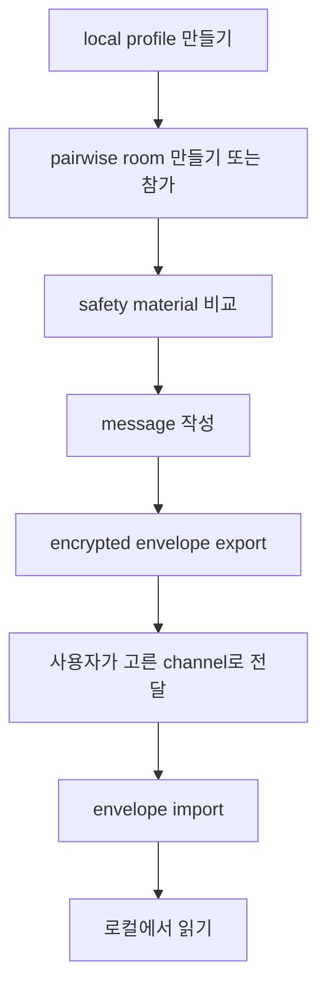

# Another Dimension Chat

[](https://github.com/answndud/another-dimension-chat/actions/workflows/verify.yml)
[](https://github.com/answndud/another-dimension-chat/releases/tag/v0.1.0-beta-onion-unsigned)
[](SECURITY.md)

[English](README.md) | 한국어

Another Dimension Chat은 Rust와 Tauri로 만든 local-first 1:1 private messenger
실험이다.

phone number, email account, searchable username, central contact discovery,
cloud message storage, push-notification dependency, cloud backup 없이 pairwise
메시징 흐름을 시험해볼 수 있게 만든다.

현재 beta에서 제공하는 것은 local profile, pairwise invite room, safety material
비교, local encrypted storage, manual encrypted envelope exchange다.

> 현재 공개 빌드는 unsigned macOS Apple Silicon beta이며, unaudited,
> non-production이고 sensitive communication에 사용하면 안 된다.


## 얻을 수 있는 것

| 해볼 수 있는 것 | 의미 |
| --- | --- |
| Pairwise invite room | global account나 searchable username 없이 invite code로 1:1 room을 시작한다. |
| Safety material 비교 | peer를 신뢰하기 전에 room safety material을 사람이 비교한다. |
| Local encrypted storage | desktop beta에서 profile, session, message storage 흐름을 로컬로 확인한다. |
| Manual encrypted envelope | message envelope를 export하고, 사용자가 고른 channel로 보내고, 상대쪽에서 import한다. |
| Local recovery action | reply, retry, cancel, conversation/session/profile delete, local wipe 흐름을 확인한다. |

## 현재 상태

| 항목 | 상태 |
| --- | --- |
| Public artifact | GitHub Release `v0.1.0-beta-onion-unsigned`의 unsigned macOS Apple Silicon beta DMG |
| Production readiness | 아님 |
| External audit | 없음 |
| Sensitive communication | 허용하지 않음 |
| Default transport | manual encrypted envelope exchange |
| External onion delivery | experimental, explicit, fail-closed, reliable delivery claim 아님 |
| Windows | local build candidate only; public artifact 없음 |
| Android / iOS | source-shell candidate only; public mobile artifact 없음 |

## macOS에서 다운로드하고 열기

<https://github.com/answndud/another-dimension-chat/releases/tag/v0.1.0-beta-onion-unsigned>

다운로드:

- `another-dimension-chat-0.1.0-beta-onion-macos-aarch64-unsigned.dmg`
- `another-dimension-chat-0.1.0-beta-onion-macos-aarch64-unsigned.dmg.sha256`

검증:

```bash
shasum -a 256 -c another-dimension-chat-0.1.0-beta-onion-macos-aarch64-unsigned.dmg.sha256
```

열기:

```text
another-dimension-chat-0.1.0-beta-onion-macos-aarch64-unsigned.dmg: OK
```

이 build는 unsigned라 macOS가 막을 수 있다. DMG를 열고 app 실행을 한 번 시도한 뒤,
checksum이 맞을 때만 System Settings > Privacy & Security에서 허용한다.

terminal quarantine-removal command를 install step으로 사용하지 않는다.

자세한 설치 도움말: [reference/UNSIGNED_PUBLIC_BETA_INSTALL.md](reference/UNSIGNED_PUBLIC_BETA_INSTALL.md)

## 앱 사용 흐름

1. local profile을 만든다.
2. pairwise room을 만들거나 invite code로 참가한다.
3. 상대와 safety material을 비교한다.
4. message를 작성한다.
5. encrypted envelope를 export한다.
6. 사용자가 고른 channel로 envelope를 보낸다.
7. 상대쪽에서 envelope를 import한다.
8. 로컬에서 읽고 필요하면 reply, retry, cancel, local data delete를 실행한다.



기본 경로는 manual envelope exchange다. advanced onion/network delivery는 별도
경로이며 explicit하고 fail-closed다. external onion delivery는 v0.1 public product
claim 밖에 있으며, external delivery claim은 하지 않는다.

## 현재 제공하지 않는 것

이 프로젝트는 현재 secure messenger를 제공하지 않는다.

현재 beta는 Briar/Cwtch equivalence, reliable external onion delivery, audited
security, production readiness, sensitive-use safety를 claim하지 않는다.

anonymous, untraceable, censorship-resistant, mobile-ready도 claim하지 않는다.
compromised endpoint, physical coercion, full global traffic correlation,
unaudited implementation bug에 대한 보호도 보장하지 않는다.

## 왜 이 프로젝트가 있나

많은 편리한 messenger는 identity, contact, delivery, push notification, backup 중
일부를 central service에 맡긴다. 이 프로젝트는 반대 방향을 시험한다. 사용자가
pairwise room을 만들고, safety material을 직접 비교하고, encrypted envelope를
직접 옮기는 흐름이다.

편의성은 떨어진다. 대신 현재 beta는 central account, mailbox, push provider,
cloud backup이 숨어 있는 것처럼 보이지 않게 trust와 delivery boundary를 드러낸다.

## Architecture

security-sensitive behavior는 Rust core가 소유한다. Tauri shell은 얇게 유지하고,
account, contact discovery, message relay, push, telemetry, backup behavior를 새로
정의하면 안 된다.

```text
crates/
  core/       profile, pairing, messaging, orchestration
  pairing/    invite payload and safety transcript logic
  protocol/   message envelopes and replay window prototype
  storage/    encrypted local storage boundary
  transport/  fail-closed transport policy and onion/runtime boundaries

apps/
  desktop-tauri/  macOS desktop beta shell
  cli/            development and boundary-check CLI
  mobile/         source-only mobile shell candidates
```

전체 ownership map은 [reference/COMPONENT_BOUNDARIES.md](reference/COMPONENT_BOUNDARIES.md)를
보면 된다.

<details>
<summary>소스에서 빌드하기</summary>

필요한 것:

- Rust stable toolchain
- `rustfmt`
- full verification용 `clippy`
- desktop Tauri shell용 Node.js와 npm

Rust component 설치:

```bash
rustup component add rustfmt clippy
```

가벼운 verification:

```bash
scripts/verify_all.sh
```

더 무거운 local engineering pass:

```bash
scripts/verify_full.sh
```

desktop dependency 설치:

```bash
cd apps/desktop-tauri
npm ci --workspaces=false
```

유용한 desktop command:

```bash
npm run dev
npm run test:ui-fast
npm run build
```

manual E2EE engine sidecar 경로를 확인할 때만 local Tauri beta shell을 실행한다.

```bash
npm run tauri:dev:beta-onion
```

local-only packaging build:

```bash
npm run tauri:build
```

이 generic Tauri build output은 public release upload artifact가 아니다.

</details>

<details>
<summary>Release and claim boundary details</summary>

Release authority는 같은 GitHub Release에 첨부된 matching asset set이다. `main`
branch에는 이후 문서나 source 변경이 들어갈 수 있으므로, downloaded app artifact를
branch file이나 GitHub source archive로 검증하지 않는다.

```text
artifact_identity=another-dimension-chat-0.1.0-beta-onion-macos-aarch64-unsigned.dmg#ddd48c1316e5eb86ca992d479270d30a151e59839e899949a1055980c4c6bf13#beta-onion#e724bd39#v0.1.0-beta-onion-unsigned#macos-aarch64
artifact_current_head_aligned=true
public_artifact_stale=false
public_artifact_state=current
next_owner_action=run-clean-macos-fresh-install-with-disposable-profile
```

Expected SHA-256:

```text
ddd48c1316e5eb86ca992d479270d30a151e59839e899949a1055980c4c6bf13
```

이 packet은 unsigned, not notarized, unaudited, non-production 상태다.

GitHub Release asset set은 current 상태이며, 다음 owner action은 disposable
profile clean macOS fresh-install run이다. pass가 accepted 되면 representative
redacted usability evidence가 다음 단계입니다.

</details>

## 문서

Start here:

- [SECURITY.md](SECURITY.md)
- [reference/PUBLIC_THREAT_MODEL.md](reference/PUBLIC_THREAT_MODEL.md)
- [reference/PRIVACY_MODEL_COMPARISON.md](reference/PRIVACY_MODEL_COMPARISON.md)

For users:

- [reference/UNSIGNED_PUBLIC_BETA_INSTALL.md](reference/UNSIGNED_PUBLIC_BETA_INSTALL.md)
- [reference/screenshots/README.md](reference/screenshots/README.md)
- [SUPPORT.md](SUPPORT.md)
- [reference/PUBLIC_SUPPORT_TRIAGE.md](reference/PUBLIC_SUPPORT_TRIAGE.md)

For reviewers:

- [reference/COMPONENT_BOUNDARIES.md](reference/COMPONENT_BOUNDARIES.md)
- [reference/PRODUCTION_DEFAULT_TRANSPORT_PATH.md](reference/PRODUCTION_DEFAULT_TRANSPORT_PATH.md)
- [reference/PRODUCTION_LOCAL_MANUAL_E2EE_CLAIM.md](reference/PRODUCTION_LOCAL_MANUAL_E2EE_CLAIM.md)
- [reference/EXTERNAL_REVIEW_AUDIT_READINESS.md](reference/EXTERNAL_REVIEW_AUDIT_READINESS.md)

For contributors and maintainers:

- [CONTRIBUTING.md](CONTRIBUTING.md)
- [scripts/verify_all.sh](scripts/verify_all.sh)
- [scripts/verify_full.sh](scripts/verify_full.sh)
- [reference/ROADMAP.md](reference/ROADMAP.md)

## Support and security reports

public issue에는 redacted support report만 올린다. broad failure class, checksum result,
platform, app version/build channel, recovery next action, copied diagnostics를 포함하면 된다.

raw logs, local paths, endpoints, invite codes, payloads, message text, passphrases,
private keys, key material, private screenshots, private planning notes는 올리지 않는다.

sensitive security report는 private vulnerability reporting을 우선 사용한다. 없으면
exploit detail 없이 minimal public security-contact request만 남긴다.

## Contributing

public issue나 pull request를 열기 전에 [CONTRIBUTING.md](CONTRIBUTING.md)를 읽는다.

public docs는 현재 implementation evidence와 non-claim에 맞춘다. v0.1 default로
central account, contact discovery, central relay, push-notification dependency,
telemetry, crash upload, auto-update, cloud backup을 추가하지 않는다.

## License

Rust workspace metadata에서 현재 `UNLICENSED`로 표시되어 있다.
