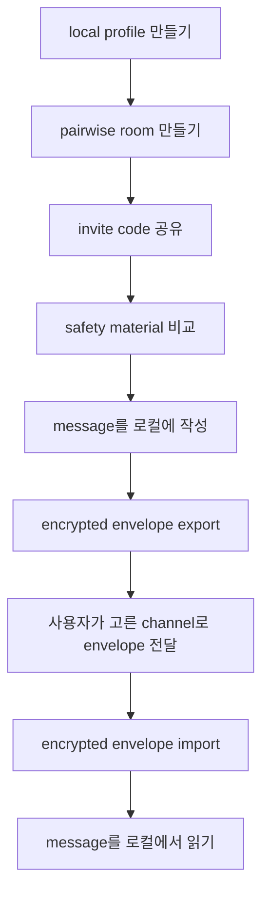

# Another Dimension Chat

[](https://github.com/answndud/another-dimension-chat/actions/workflows/verify.yml)
[](https://github.com/answndud/another-dimension-chat/releases/tag/v0.1.0-beta-onion-unsigned)
[](SECURITY.md)

[English](README.md) | 한국어

Another Dimension Chat은 Rust와 Tauri로 만든 local-first 1:1 private messenger 실험이다.
central account, phone number, searchable username, central contact discovery,
cloud message storage, push-notification dependency, cloud backup을 피하는 방향으로 설계했다.

현재 beta는 pairwise invite room, safety material 비교, local encrypted storage,
manual encrypted envelope exchange를 사용한다.

> 현재 공개 빌드는 unsigned macOS Apple Silicon beta이며, unaudited, non-production, sensitive communication 불가 상태다.


## 현재 상태

| 항목 | 상태 |
| --- | --- |
| Public artifact | GitHub Release `v0.1.0-beta-onion-unsigned`의 unsigned macOS Apple Silicon beta DMG |
| Production readiness | 아님 |
| External audit | 없음 |
| Sensitive communication | 허용하지 않음 |
| Default transport | manual encrypted envelope exchange |
| External onion delivery | experimental, explicit, fail-closed, reliable delivery claim 아님 |
| Windows | local build candidate only; public artifact 없음 |
| Android / iOS | source-shell candidate only; public mobile artifact 없음 |

공개용 screenshot은 [reference/screenshots/README.md](reference/screenshots/README.md)를 보세요.
private room data가 보이는 이미지는 올리지 말고, 다른 앱 이미지를 게시하기 전에는
[reference/PUBLIC_SCREENSHOT_CHECKLIST.md](reference/PUBLIC_SCREENSHOT_CHECKLIST.md)를 확인하세요.

## 왜 이 프로젝트가 있나

이 프로젝트의 목표는 default 1:1 messaging 경로에서 central trust를 줄이면서,
security-sensitive behavior는 Rust core에 남겨두는 것이다.

편의성은 일부 포기한다. pairwise room, safety comparison, manual envelope exchange는
central mailbox, searchable identity layer, push provider, reliable automatic delivery를
암시하지 않기 위해 현재 beta에 들어 있다.

## 지금 테스트할 수 있는 것

현재 beta로 로컬 desktop 흐름을 끝까지 확인할 수 있다.

1. local profile 만들기
2. invite code로 pairwise room 만들기 또는 참가하기
3. room을 trust하기 전에 safety material 비교하기
4. message를 로컬에 작성하기
5. encrypted message envelope export하기
6. 사용자가 정한 channel로 envelope 보내기
7. 상대쪽에서 encrypted envelope import하기
8. message를 로컬에서 읽기
9. 필요하면 reply, retry, cancel, local data delete 실행하기

## macOS beta 사용하기

DMG와 checksum 파일을 같은 GitHub Release에서 내려받으세요.

<https://github.com/answndud/another-dimension-chat/releases/tag/v0.1.0-beta-onion-unsigned>

- `another-dimension-chat-0.1.0-beta-onion-macos-aarch64-unsigned.dmg`
- `another-dimension-chat-0.1.0-beta-onion-macos-aarch64-unsigned.dmg.sha256`

열기 전에 checksum을 확인합니다.

```bash
shasum -a 256 -c another-dimension-chat-0.1.0-beta-onion-macos-aarch64-unsigned.dmg.sha256
```

checksum이 맞으면 DMG를 열고 app을 한 번 실행해 보세요. 이 build는 unsigned이므로 macOS가 차단할 수 있습니다.
검증 후에만 Privacy & Security의 정상 allow 흐름을 사용하세요.

프로젝트 문서가 명시하지 않는 unsafe terminal quarantine-removal command는 쓰지 마세요.

<details>
<summary>Artifact details and release metadata</summary>

아래 값은 release note, install guide, beta checklist와 동일하게 유지해야 합니다.

```text
artifact_identity=another-dimension-chat-0.1.0-beta-onion-macos-aarch64-unsigned.dmg#ddd48c1316e5eb86ca992d479270d30a151e59839e899949a1055980c4c6bf13#beta-onion#e724bd39#v0.1.0-beta-onion-unsigned#macos-aarch64
artifact_current_head_aligned=true
public_artifact_stale=false
public_artifact_state=current
next_owner_action=run-clean-macos-fresh-install-with-disposable-profile
```

Expected SHA-256:

```text
ddd48c1316e5eb86ca992d479270d30a151e59839e899949a1055980c4c6bf13
```

이 packet은 unsigned, not notarized, unaudited, non-production 상태다.

</details>

자세한 설치 절차는 [reference/UNSIGNED_PUBLIC_BETA_INSTALL.md](reference/UNSIGNED_PUBLIC_BETA_INSTALL.md)를 보세요.

## 현재 message flow



기본 경로는 manual envelope exchange다.
experimental onion/network delivery는 별도 경로이며 explicit하고 fail-closed다.
reliable delivery claim은 하지 않는다.

## Security boundary

high-risk threat model은 design target이지, 현재 safety guarantee가 아니다.

현재 beta의 한계는 다음과 같다.

- compromised endpoint 보호 불가
- physical coercion 보호 불가
- full global traffic correlation 보호 불가
- unaudited implementation bug에 대한 audit claim 없음
- external onion delivery reliability claim 없음

자세한 boundary는 [SECURITY.md](SECURITY.md)와 [reference/PUBLIC_THREAT_MODEL.md](reference/PUBLIC_THREAT_MODEL.md)를 보세요.

## 현재 제공하지 않는 것

이 프로젝트는 현재 아래를 claim하지 않는다.

- secure
- audited
- production-ready
- anonymous 또는 untraceable
- Briar/Cwtch-equivalent
- sensitive communication에 적합한 제품
- current public Android/iOS artifact

또한 일반적인 serverless chat demo가 아니다. v0.1에는 phone number, email identity,
searchable username, central contact discovery, central message server, push notification,
cloud backup이 없다.

## Architecture highlights

security-sensitive behavior는 Rust core가 소유해야 한다. Tauri desktop shell은 thin하게 유지해야 한다.
UI는 account, contact discovery, relay, push, telemetry, backup behavior를 새로 만들면 안 된다.

```text
crates/
  core/        profile, pairing, messaging, orchestration
  pairing/     pairing payload and safety transcript logic
  protocol/    message envelope and replay window prototype
  storage/     encrypted local storage boundary
  transport/   fail-closed transport policy and onion/runtime boundaries

apps/
  cli/         development and boundary-check CLI
  desktop-tauri/  macOS desktop beta shell
  mobile/      source-only mobile shell candidates
```

## 소스에서 빌드

필요한 것:

- Rust stable toolchain
- `rustfmt`
- full verification용 `clippy`
- desktop Tauri shell용 Node.js와 npm

Rust component 설치:

```bash
rustup component add rustfmt clippy
```

가벼운 verification:

```bash
scripts/verify_all.sh
```

더 무거운 local engineering pass:

```bash
scripts/verify_full.sh
```

desktop dependency 설치:

```bash
cd apps/desktop-tauri
npm ci --workspaces=false
```

유용한 desktop command:

```bash
npm run dev
npm run test:ui-fast
npm run build
```

manual E2EE engine sidecar를 확인할 때만 local Tauri beta shell을 실행합니다.

```bash
npm run tauri:dev:beta-onion
```

local-only packaging build:

```bash
npm run tauri:build
```

## 문서 맵

### Start here

- [SECURITY.md](SECURITY.md)
- [reference/PUBLIC_THREAT_MODEL.md](reference/PUBLIC_THREAT_MODEL.md)
- [reference/PRIVACY_MODEL_COMPARISON.md](reference/PRIVACY_MODEL_COMPARISON.md)

### For users

- [reference/UNSIGNED_PUBLIC_BETA_INSTALL.md](reference/UNSIGNED_PUBLIC_BETA_INSTALL.md)
- [reference/screenshots/README.md](reference/screenshots/README.md)
- [SUPPORT.md](SUPPORT.md)
- [reference/PUBLIC_SUPPORT_TRIAGE.md](reference/PUBLIC_SUPPORT_TRIAGE.md)

### For reviewers

- [reference/COMPONENT_BOUNDARIES.md](reference/COMPONENT_BOUNDARIES.md)
- [reference/PRODUCTION_DEFAULT_TRANSPORT_PATH.md](reference/PRODUCTION_DEFAULT_TRANSPORT_PATH.md)
- [reference/PRODUCTION_LOCAL_MANUAL_E2EE_CLAIM.md](reference/PRODUCTION_LOCAL_MANUAL_E2EE_CLAIM.md)
- [reference/EXTERNAL_REVIEW_AUDIT_READINESS.md](reference/EXTERNAL_REVIEW_AUDIT_READINESS.md)

### For contributors / maintainers

- [CONTRIBUTING.md](CONTRIBUTING.md)
- [scripts/verify_all.sh](scripts/verify_all.sh)
- [scripts/verify_full.sh](scripts/verify_full.sh)
- [reference/ROADMAP.md](reference/ROADMAP.md)

## Support / security reports

public issue에는 redacted support report만 올리세요. broad failure class, checksum result,
platform, app version/build channel, recovery next action, copied diagnostics를 포함하면 됩니다.

raw logs, local paths, endpoints, invite codes, payloads, message text, passphrases, private keys,
key material, private screenshots, private planning notes는 올리지 마세요.

sensitive security report는 private vulnerability reporting을 우선 사용하세요. 없으면 exploit detail 없이
minimal public security-contact request만 남기세요.

## Contributing

public issue나 pull request를 열기 전에 [CONTRIBUTING.md](CONTRIBUTING.md)를 읽으세요.

요약:

- no-central-trusted-server 방향을 유지한다
- fake 또는 development behavior는 `dev-insecure` 뒤에 둔다
- private planning notes는 public change에 넣지 않는다
- v0.1 default로 central account, contact discovery, central relay, push-notification dependency, telemetry,
  crash upload, auto-update, cloud backup을 추가하지 않는다
- public docs를 현재 구현 evidence와 non-claim에 맞춘다

## License

Rust workspace metadata에서 현재 `UNLICENSED`로 표시되어 있다.
