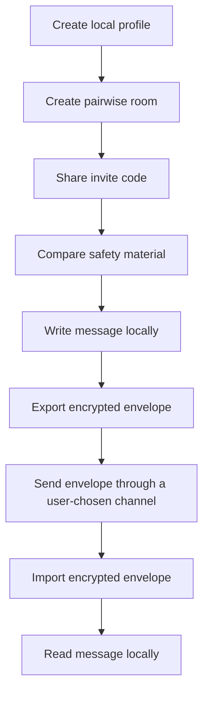

# Another Dimension Chat

[](https://github.com/answndud/another-dimension-chat/actions/workflows/verify.yml)
[](https://github.com/answndud/another-dimension-chat/releases/tag/v0.1.0-beta-onion-unsigned)
[](SECURITY.md)

English | [한국어](README.ko.md)

Another Dimension Chat is a local-first 1:1 private messenger experiment built in Rust and Tauri.
It avoids central accounts, phone numbers, searchable usernames, central contact discovery,
cloud message storage, push-notification dependency, and cloud backup.

The current beta uses pairwise invite rooms, safety material comparison, local encrypted storage,
and manual encrypted envelope exchange.

> Current public build: unsigned macOS Apple Silicon beta, unaudited, non-production, and not for sensitive communication.


## Current Status

| Area | Status |
| --- | --- |
| Public artifact | Unsigned macOS Apple Silicon beta DMG on GitHub Release `v0.1.0-beta-onion-unsigned` |
| Production readiness | No |
| External audit | No |
| Sensitive communication | Not allowed |
| Default transport | Manual encrypted envelope exchange |
| External onion delivery | Experimental, explicit, fail-closed, not a reliable delivery claim |
| Windows | Local build candidate only; no public artifact |
| Android / iOS | Source-shell candidates only; no public mobile artifact |

For public-safe screenshots, see [reference/screenshots/README.md](reference/screenshots/README.md).
Do not post screenshots that show private room data. Use [reference/PUBLIC_SCREENSHOT_CHECKLIST.md](reference/PUBLIC_SCREENSHOT_CHECKLIST.md) before publishing any other app image.

## Why This Exists

The project is intentionally narrow: it is trying to remove central trust from the default 1:1 messaging path while keeping security-sensitive behavior in Rust.

The tradeoff is convenience. Pairwise rooms, safety comparison, and manual envelope exchange are part of the current beta because the project does not want to imply a central mailbox, searchable identity layer, push provider, or reliable automatic delivery.

## What You Can Try Today

You can use the current beta to exercise the local desktop flow end to end:

1. Create a local profile.
2. Create or join a pairwise room with an invite code.
3. Compare safety material before trusting the room.
4. Write a message locally.
5. Export the encrypted message envelope.
6. Send the envelope through a user-chosen channel.
7. Import the encrypted envelope on the other side.
8. Read the message locally.
9. Reply, retry, cancel, or delete local data as needed.

## Try The macOS Beta

The current public unsigned packet is attached to this GitHub Release tag.

Download the DMG and matching checksum file from the same GitHub Release:

<https://github.com/answndud/another-dimension-chat/releases/tag/v0.1.0-beta-onion-unsigned>

- `another-dimension-chat-0.1.0-beta-onion-macos-aarch64-unsigned.dmg`
- `another-dimension-chat-0.1.0-beta-onion-macos-aarch64-unsigned.dmg.sha256`

Verify the DMG before opening it:

```bash
shasum -a 256 -c another-dimension-chat-0.1.0-beta-onion-macos-aarch64-unsigned.dmg.sha256
```

If the checksum matches, open the DMG and then open the app once.
Because this build is unsigned, macOS may block it. Use the normal Privacy & Security allow flow only after verification.

Do not use unsafe terminal quarantine-removal commands unless the project docs explicitly require them. They do not.

<details>
<summary>Artifact details and release metadata</summary>

The following details are intentionally kept stable across the release notes, install guide, and beta checklist:

```text
artifact_identity=another-dimension-chat-0.1.0-beta-onion-macos-aarch64-unsigned.dmg#ddd48c1316e5eb86ca992d479270d30a151e59839e899949a1055980c4c6bf13#beta-onion#e724bd39#v0.1.0-beta-onion-unsigned#macos-aarch64
artifact_current_head_aligned=true
public_artifact_stale=false
public_artifact_state=current
next_owner_action=run-clean-macos-fresh-install-with-disposable-profile
```

Expected SHA-256:

```text
ddd48c1316e5eb86ca992d479270d30a151e59839e899949a1055980c4c6bf13
```

This packet is unsigned, not notarized, unaudited, and not production-ready.

</details>

Detailed install steps live in [reference/UNSIGNED_PUBLIC_BETA_INSTALL.md](reference/UNSIGNED_PUBLIC_BETA_INSTALL.md).

## How The Current Message Flow Works



The default path is manual envelope exchange.
Experimental onion/network delivery is separate, explicit, and fail-closed. It is not a reliable delivery claim.

## Security Boundary

The high-risk threat model is a design target, not a current safety guarantee.

Current beta limitations include:

- compromised endpoints are not protected
- physical coercion is not protected
- full global traffic correlation is not protected
- implementation bugs are not covered by an audit claim
- external onion delivery is not reliable

Read the public boundary in [SECURITY.md](SECURITY.md) and the current threat model in [reference/PUBLIC_THREAT_MODEL.md](reference/PUBLIC_THREAT_MODEL.md).

## What This Is Not

This project does not currently claim to be:

- secure
- audited
- production-ready
- anonymous or untraceable
- Briar/Cwtch-equivalent
- suitable for sensitive communication
- a mobile product with current public Android or iOS artifacts

It is also not a generic serverless-chat demo. v0.1 does not include phone numbers, email identities, searchable usernames, central contact discovery, central message servers, push notifications, or cloud backup.

## Architecture Highlights

Security-sensitive behavior belongs in the Rust core. The Tauri desktop shell should stay thin.
The UI must not invent account, contact-discovery, relay, push, telemetry, or backup behavior.

```text
crates/
  core/        profile, pairing, messaging, orchestration
  pairing/     pairing payload and safety transcript logic
  protocol/    message envelope and replay window prototype
  storage/     encrypted local storage boundary
  transport/   fail-closed transport policy and onion/runtime boundaries

apps/
  cli/         development and boundary-check CLI
  desktop-tauri/  macOS desktop beta shell
  mobile/      source-only mobile shell candidates
```

## Build From Source

Requirements:

- Rust stable toolchain
- `rustfmt`
- `clippy` for the full verification pass
- Node.js and npm for the desktop Tauri shell

Install Rust components:

```bash
rustup component add rustfmt clippy
```

Run the lightweight verification path:

```bash
scripts/verify_all.sh
```

Run the heavier local engineering pass only when needed:

```bash
scripts/verify_full.sh
```

Install desktop dependencies:

```bash
cd apps/desktop-tauri
npm ci --workspaces=false
```

Useful desktop commands:

```bash
npm run dev
npm run test:ui-fast
npm run build
```

The local Tauri beta shell can be run with the manual E2EE engine sidecar only when checking that adapter path:

```bash
npm run tauri:dev:beta-onion
```

Local-only packaging build:

```bash
npm run tauri:build
```

## Documentation Map

### Start Here

- [SECURITY.md](SECURITY.md)
- [reference/PUBLIC_THREAT_MODEL.md](reference/PUBLIC_THREAT_MODEL.md)
- [reference/PRIVACY_MODEL_COMPARISON.md](reference/PRIVACY_MODEL_COMPARISON.md)

### For Users

- [reference/UNSIGNED_PUBLIC_BETA_INSTALL.md](reference/UNSIGNED_PUBLIC_BETA_INSTALL.md)
- [reference/screenshots/README.md](reference/screenshots/README.md)
- [SUPPORT.md](SUPPORT.md)
- [reference/PUBLIC_SUPPORT_TRIAGE.md](reference/PUBLIC_SUPPORT_TRIAGE.md)

### For Reviewers

- [reference/COMPONENT_BOUNDARIES.md](reference/COMPONENT_BOUNDARIES.md)
- [reference/PRODUCTION_DEFAULT_TRANSPORT_PATH.md](reference/PRODUCTION_DEFAULT_TRANSPORT_PATH.md)
- [reference/PRODUCTION_LOCAL_MANUAL_E2EE_CLAIM.md](reference/PRODUCTION_LOCAL_MANUAL_E2EE_CLAIM.md)
- [reference/EXTERNAL_REVIEW_AUDIT_READINESS.md](reference/EXTERNAL_REVIEW_AUDIT_READINESS.md)

### For Contributors / Maintainers

- [CONTRIBUTING.md](CONTRIBUTING.md)
- [scripts/verify_all.sh](scripts/verify_all.sh)
- [scripts/verify_full.sh](scripts/verify_full.sh)
- [reference/ROADMAP.md](reference/ROADMAP.md)

## Support / Security Reports

Use public issues only for redacted support reports. Include the broad failure class, checksum result, platform, app version or build channel, recovery next action, and copied diagnostics.

Do not post raw logs, local paths, endpoints, invite codes, payloads, message text, passphrases, private keys, key material, private screenshots, or private planning notes.

For sensitive security reports, use private vulnerability reporting when available. If it is not available, open only a minimal public security-contact request without exploit details.

## Contributing

Read [CONTRIBUTING.md](CONTRIBUTING.md) before opening public issues or pull requests.

In short:

- keep the no-central-trusted-server product direction
- keep fake or development behavior behind `dev-insecure`
- keep private planning notes out of public changes
- do not add central accounts, contact discovery, central relays, push-notification dependencies, telemetry, crash upload, auto-update, or cloud backup as v0.1 defaults
- keep public docs aligned with current implementation evidence and non-claims

## License

This repository is currently marked `UNLICENSED` in the Rust workspace metadata.
