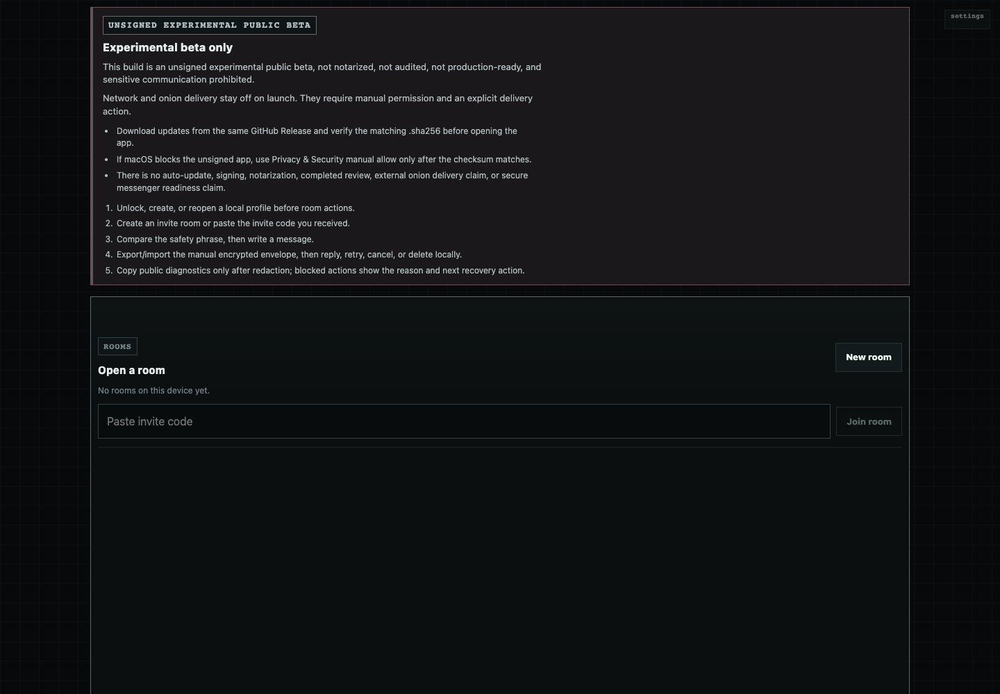
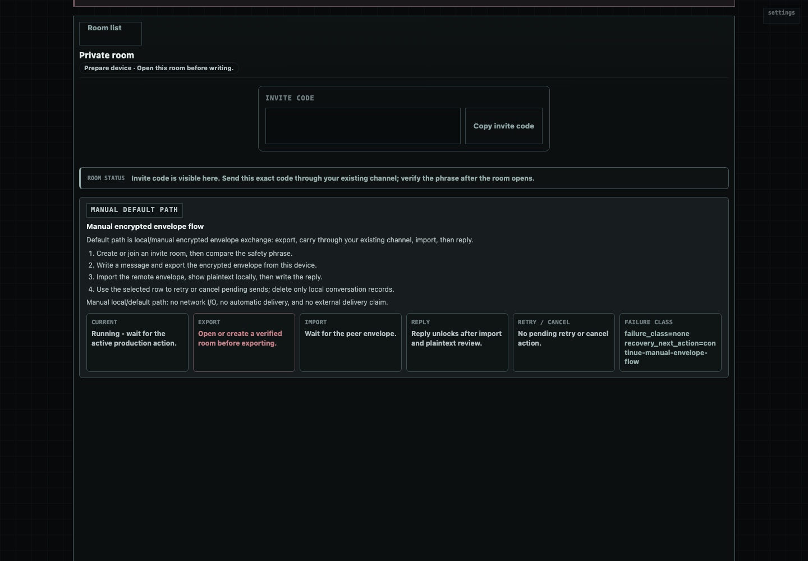
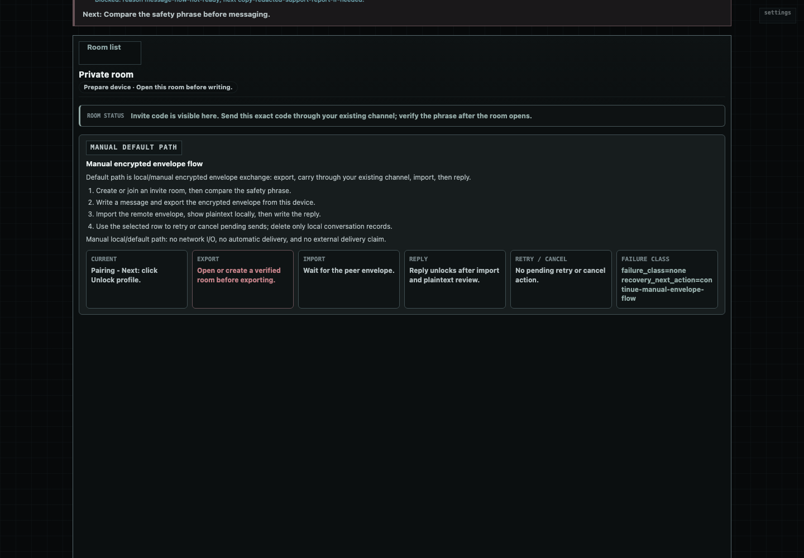

# Another Dimension Chat — Unsigned Public Beta

<p>
  
  
  
</p>

English | [한국어](README.ko.md)

**A local-first 1:1 messenger beta that avoids accounts, phone numbers,
contact discovery, cloud message storage, and push-notification dependency.**

Built with **Rust** and **Tauri**. Current testing uses pairwise invite rooms,
safety material comparison, local encrypted storage, and manual sealed-message
exchange.

> **Current status:** unsigned macOS Apple Silicon beta. Not audited, not
> production-ready, and not for sensitive communication.

## Download

> [**another-dimension-chat/releases/tag/v0.1.0-beta-onion-unsigned**](https://github.com/answndud/another-dimension-chat/releases/tag/v0.1.0-beta-onion-unsigned)

**2 files** to download from Assets:

| File | Purpose |
|------|---------|
| `*.dmg` | The app |
| `*.dmg.sha256` | Checksum for verification |

Verify before opening:

```sh
shasum -a 256 -c *.dmg.sha256
```

Expected output:

```text
another-dimension-chat-0.1.0-beta-onion-macos-aarch64-unsigned.dmg: OK
```

Proceed only if the output is `OK`. If macOS blocks the unsigned app, allow via
System Settings > Privacy & Security after checksum verification.

## Quick Start

1. Create a local profile.
2. Create or join a pairwise room via invite code.
3. Compare safety material with the other person.
4. Write a message and export a sealed message (`encrypted envelope`).
5. Send that file/text through your own channel.
6. Import it on the other side, then reply the same way.

There is no central account, searchable username, contact discovery service,
message relay, cloud backup, or push notification service.

## Screenshots

<table>
<tr>
  <td></td>
  <td></td>
  <td></td>
</tr>
<tr>
  <td align="center">Create a local profile</td>
  <td align="center">Share one invite code</td>
  <td align="center">Export a sealed message</td>
</tr>
</table>

[More screenshots](reference/screenshots/)

## Platforms

| Platform | Public status |
|----------|---------------|
| macOS Apple Silicon | Unsigned DMG beta |
| Windows | No public app yet |
| Android / iOS | No public app yet |

## Before Using

This beta makes **no security claim**. Experimental onion/network delivery is
explicit, fail-closed, and not a reliable delivery claim.

Read [SECURITY.md](SECURITY.md). For support, open a redacted public issue:
no invite codes, payloads, keys, raw logs, or screenshots of private room data.

## From Source

```sh
git clone https://github.com/answndud/another-dimension-chat.git
cd another-dimension-chat
scripts/verify_all.sh   # light verify
scripts/verify_full.sh  # full pre-release verify
```

See [CONTRIBUTING.md](CONTRIBUTING.md) for more. The project license has not
been selected yet; do not treat this repository as permissively licensed.
