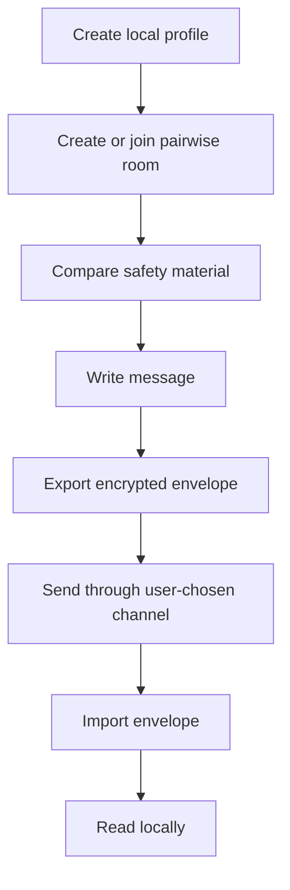

# Another Dimension Chat

[](https://github.com/answndud/another-dimension-chat/actions/workflows/verify.yml)
[](https://github.com/answndud/another-dimension-chat/releases/tag/v0.1.0-beta-onion-unsigned)
[](SECURITY.md)

English | [한국어](README.ko.md)

Another Dimension Chat is a local-first 1:1 private messenger experiment built
with Rust and Tauri.

It is for people who want to try a pairwise messaging flow without phone
numbers, email accounts, searchable usernames, central contact discovery, cloud
message storage, push-notification dependency, or cloud backup.

The current beta gives you a local profile, a pairwise invite room, safety
material comparison, local encrypted storage, and manual encrypted envelope
exchange.

> Current public build: unsigned macOS Apple Silicon beta, unaudited,
> non-production, and not for sensitive communication.


## What You Get

| You can try | What that means |
| --- | --- |
| Pairwise invite room | Start a 1:1 room from an invite code instead of a global account or searchable username. |
| Safety material comparison | Compare room safety material before trusting the peer. |
| Local encrypted storage | Exercise local profile, session, and message storage on the desktop beta. |
| Manual encrypted envelopes | Export a message envelope, send it through a channel you choose, and import it on the other side. |
| Local recovery actions | Retry, cancel, reply, delete a conversation, delete a session, delete a profile, or wipe app-owned local data. |

## Current Status

| Area | Status |
| --- | --- |
| Public artifact | Unsigned macOS Apple Silicon beta DMG on GitHub Release `v0.1.0-beta-onion-unsigned` |
| Production readiness | No |
| External audit | No |
| Sensitive communication | Not allowed |
| Default transport | Manual encrypted envelope exchange |
| External onion delivery | Experimental, explicit, fail-closed, not a reliable delivery claim |
| Windows | Local build candidate only; no public artifact |
| Android / iOS | Source-shell candidates only; no public mobile artifact |

## Download And Open On macOS

The current public unsigned packet is attached to this GitHub Release tag:

<https://github.com/answndud/another-dimension-chat/releases/tag/v0.1.0-beta-onion-unsigned>

Download both files from that release:

- `another-dimension-chat-0.1.0-beta-onion-macos-aarch64-unsigned.dmg`
- `another-dimension-chat-0.1.0-beta-onion-macos-aarch64-unsigned.dmg.sha256`

Verify the DMG before opening it:

```bash
shasum -a 256 -c another-dimension-chat-0.1.0-beta-onion-macos-aarch64-unsigned.dmg.sha256
```

Expected result:

```text
another-dimension-chat-0.1.0-beta-onion-macos-aarch64-unsigned.dmg: OK
```

Because this build is unsigned, macOS may block it. Open the DMG, try to open
the app once, then allow the blocked app from System Settings > Privacy & Security only after the checksum matches.

Do not use terminal quarantine-removal commands as an install step.

Detailed install help: [reference/UNSIGNED_PUBLIC_BETA_INSTALL.md](reference/UNSIGNED_PUBLIC_BETA_INSTALL.md)

## Use The App

1. Create a local profile.
2. Create a pairwise room or join one with an invite code.
3. Compare safety material with the other person.
4. Write a message.
5. Export the encrypted envelope.
6. Send that envelope through any channel you choose.
7. Import the envelope on the other side.
8. Read locally, then reply, retry, cancel, or delete local data as needed.



The default path is manual envelope exchange. Advanced onion/network delivery is
separate, explicit, and fail-closed. External onion delivery is outside the v0.1 public product claim, and no external delivery claim is made.

## What This Is Not

This project does not currently provide a secure messenger.

The beta does not claim Briar/Cwtch equivalence, reliable external onion
delivery, audited security, production readiness, or sensitive-use safety.

It also does not claim to be anonymous, untraceable, censorship-resistant,
mobile-ready, or safe against compromised endpoints, physical coercion, full
global traffic correlation, or unaudited implementation bugs.

## Why It Exists

Most convenient messengers depend on some central service for identity,
contacts, delivery, push notifications, or backup. This project explores the
opposite default: local-first 1:1 rooms where users explicitly compare safety
material and move encrypted envelopes themselves.

That is less convenient. The point of the current beta is to make the trust and
delivery boundary visible instead of hiding it behind a central account,
mailbox, push provider, or cloud backup.

## Architecture

Security-sensitive behavior belongs in the Rust core. The Tauri shell should
remain thin and must not invent account, contact discovery, message relay,
push, telemetry, or backup behavior.

```text
crates/
  core/       profile, pairing, messaging, orchestration
  pairing/    invite payload and safety transcript logic
  protocol/   message envelopes and replay window prototype
  storage/    encrypted local storage boundary
  transport/  fail-closed transport policy and onion/runtime boundaries

apps/
  desktop-tauri/  macOS desktop beta shell
  cli/            development and boundary-check CLI
  mobile/         source-only mobile shell candidates
```

Read [reference/COMPONENT_BOUNDARIES.md](reference/COMPONENT_BOUNDARIES.md) for
the full ownership map.

<details>
<summary>Build from source</summary>

Requirements:

- Rust stable toolchain
- `rustfmt`
- `clippy` for the full verification pass
- Node.js and npm for the desktop Tauri shell

Install Rust components:

```bash
rustup component add rustfmt clippy
```

Run the lightweight verification path:

```bash
scripts/verify_all.sh
```

Run the heavier local engineering pass only when needed:

```bash
scripts/verify_full.sh
```

Install desktop dependencies:

```bash
cd apps/desktop-tauri
npm ci --workspaces=false
```

Useful desktop commands:

```bash
npm run dev
npm run test:ui-fast
npm run build
```

Run the local Tauri beta shell with the manual E2EE engine sidecar only when
checking that adapter path:

```bash
npm run tauri:dev:beta-onion
```

Build a local-only packaging artifact:

```bash
npm run tauri:build
```

This generic Tauri build output is not a public release upload artifact.

</details>

<details>
<summary>Release and claim boundary details</summary>

Release authority:

The release authority for a DMG is the matching set of assets attached to the
same GitHub Release. The `main` branch may contain later documentation or source
changes, so do not verify downloaded app artifacts against branch files or
GitHub source archives.

Artifact identity:

```text
artifact_identity=another-dimension-chat-0.1.0-beta-onion-macos-aarch64-unsigned.dmg#ddd48c1316e5eb86ca992d479270d30a151e59839e899949a1055980c4c6bf13#beta-onion#e724bd39#v0.1.0-beta-onion-unsigned#macos-aarch64
artifact_current_head_aligned=true
public_artifact_stale=false
public_artifact_state=current
next_owner_action=run-clean-macos-fresh-install-with-disposable-profile
```

Expected SHA-256:

```text
ddd48c1316e5eb86ca992d479270d30a151e59839e899949a1055980c4c6bf13
```

The current public unsigned packet is a source-prepared packet accepted by
`scripts/prepare_unsigned_public_beta_release.sh`, build channel `beta-onion`,
commit `e724bd39`, release tag `v0.1.0-beta-onion-unsigned`, and SHA-256
`ddd48c1316e5eb86ca992d479270d30a151e59839e899949a1055980c4c6bf13`.

The GitHub Release asset set is current; next owner action is a clean macOS
fresh-install run with a disposable profile, followed by representative
redacted usability evidence if that pass is accepted.

This is not a packaging readiness, audit readiness, or release go signal.

Required public boundary phrases retained for policy checks:

This is an unsigned experimental public beta, not audited, not production-ready,
and sensitive communication prohibited.

The ordinary-use public copy scope is no phone number, no email identity, no global
account, a pairwise invite, mandatory safety comparison, encrypted
user-mediated message exchange, and local data ownership.

High-Risk Mode is a defined threat-model target, not a current safety guarantee.
It does not protect compromised endpoints, direct coercion, or full global
traffic correlation.

Desktop-only v0.1 acceptance matrix, desktop local-private-flow acceptance blockers,
and source-only public beta checks are handled by `scripts/public_release_readiness_preflight.sh`.

macOS unsigned public beta source closure references
[reference/RELEASE_PAGE_UPDATE_POLICY.json](reference/RELEASE_PAGE_UPDATE_POLICY.json),
[reference/MACOS_FRESH_INSTALL_REHEARSAL.md](reference/MACOS_FRESH_INSTALL_REHEARSAL.md),
[reference/MACOS_FRESH_INSTALL_REHEARSAL_RESULT.md](reference/MACOS_FRESH_INSTALL_REHEARSAL_RESULT.md),
[reference/MACOS_PUBLIC_BETA_FINAL_REPORT.md](reference/MACOS_PUBLIC_BETA_FINAL_REPORT.md),
[reference/screenshots/README.md](reference/screenshots/README.md), and
[reference/PUBLIC_SUPPORT_TRIAGE.md](reference/PUBLIC_SUPPORT_TRIAGE.md).
The readiness target is 100% for source closure only; the production readiness
definition and claim gate still block production/security claims.

Signing, notarization, app-store approval, SmartScreen reputation, Google Play,
TestFlight, APNs, FCM, iCloud, or cloud backup may affect distribution
ergonomics later. None of them is treated as the trusted security boundary.

</details>

## Documentation

Start here:

- [SECURITY.md](SECURITY.md)
- [reference/PUBLIC_THREAT_MODEL.md](reference/PUBLIC_THREAT_MODEL.md)
- [reference/PRIVACY_MODEL_COMPARISON.md](reference/PRIVACY_MODEL_COMPARISON.md)

For users:

- [reference/UNSIGNED_PUBLIC_BETA_INSTALL.md](reference/UNSIGNED_PUBLIC_BETA_INSTALL.md)
- [reference/screenshots/README.md](reference/screenshots/README.md)
- [SUPPORT.md](SUPPORT.md)
- [reference/PUBLIC_SUPPORT_TRIAGE.md](reference/PUBLIC_SUPPORT_TRIAGE.md)

For reviewers:

- [reference/COMPONENT_BOUNDARIES.md](reference/COMPONENT_BOUNDARIES.md)
- [reference/PRODUCTION_DEFAULT_TRANSPORT_PATH.md](reference/PRODUCTION_DEFAULT_TRANSPORT_PATH.md)
- [reference/PRODUCTION_LOCAL_MANUAL_E2EE_CLAIM.md](reference/PRODUCTION_LOCAL_MANUAL_E2EE_CLAIM.md)
- [reference/EXTERNAL_REVIEW_AUDIT_READINESS.md](reference/EXTERNAL_REVIEW_AUDIT_READINESS.md)

For contributors and maintainers:

- [CONTRIBUTING.md](CONTRIBUTING.md)
- [scripts/verify_all.sh](scripts/verify_all.sh)
- [scripts/verify_full.sh](scripts/verify_full.sh)
- [reference/ROADMAP.md](reference/ROADMAP.md)

## Support And Security Reports

Use public issues only for redacted support reports. Include the broad failure
class, checksum result, platform, app version or build channel, recovery next
action, and copied diagnostics.

Do not post raw logs, local paths, endpoints, invite codes, payloads, message
text, passphrases, private keys, key material, private screenshots, or private
planning notes.

For sensitive security reports, use private vulnerability reporting when
available. If it is not available, open only a minimal public security-contact
request without exploit details.

## Contributing

Read [CONTRIBUTING.md](CONTRIBUTING.md) before opening public issues or pull
requests.

Keep public docs aligned with current implementation evidence and non-claims.
Do not add central accounts, contact discovery, central relays,
push-notification dependencies, telemetry, crash upload, auto-update, or cloud
backup as v0.1 defaults.

## License

This repository is currently marked `UNLICENSED` in the Rust workspace metadata.
