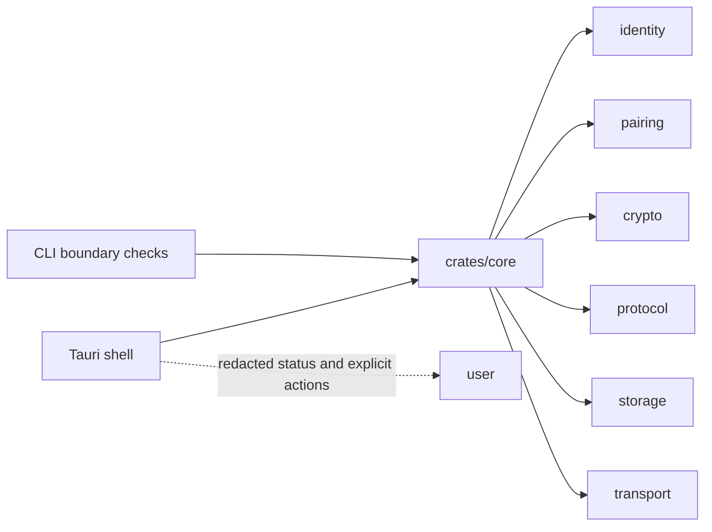

# Rust Core And Tauri Shell

The main architecture rule is simple:

> Security-sensitive meaning belongs in Rust core code, not in thin UI shells.

The Tauri app is the product surface. It should show state, collect explicit
user action, and display redacted diagnostics. It should not invent protocol,
storage, pairing, transport, contact discovery, account, push, or cloud-backup
semantics.

## Workspace Shape

```text
crates/
  identity/    pairwise identity and contact types
  pairing/     pairing payloads and safety transcript logic
  crypto/      cryptographic boundary code and test fixtures
  protocol/    message envelopes, replay windows, and retention rules
  transport/   fail-closed transport policy, onion/runtime boundaries
  storage/     encrypted local storage and lifecycle policy boundary
  core/        profile, pairing, messaging, and orchestration

apps/
  cli/              development and boundary-check CLI
  desktop-tauri/    macOS desktop beta shell
  mobile/           source-only mobile shell candidates
```

The same map is shown in the public [README](../README.md).

## Boundary Map



## Source Anchors

- [crates/identity/src/lib.rs](../crates/identity/src/lib.rs) defines profile,
  contact, and pairwise key wrappers.
- [crates/pairing/src/lib.rs](../crates/pairing/src/lib.rs) defines pairing
  payloads, canonical bytes, signatures, and safety transcripts.
- [crates/protocol/src/lib.rs](../crates/protocol/src/lib.rs) defines message
  envelopes, padding buckets, and replay windows.
- [crates/storage/src/lib.rs](../crates/storage/src/lib.rs) defines local
  encrypted storage and lifecycle boundaries.
- [crates/transport/src/lib.rs](../crates/transport/src/lib.rs) defines
  fail-closed transport guardrails.
- [crates/core/src/lib.rs](../crates/core/src/lib.rs) orchestrates the product
  flows used by the CLI and desktop app.

## Why This Matters

Thin shell architecture is not just a cleanliness preference here. If the UI
starts defining its own protocol or storage meaning, future ports can diverge
silently. Keeping meaning in shared Rust code makes the project easier to test,
review, and explain.

## Interview Summary

I used Rust as the shared product core and Tauri as a thin desktop shell. The
core owns identity, pairing, protocol, storage, transport, and orchestration.
The shell owns user interaction, redacted status, and explicit actions. That
separation keeps security-sensitive meaning out of frontend-only state.
