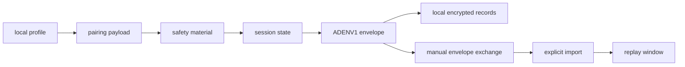

# Pairing, Envelopes, Storage, And Transport

The technical center of the project is not a single feature. It is the chain of
boundaries that turns "two people want to talk" into local, inspectable state.

## Pairing

Pairing must work without global usernames or central contact discovery. The
pairing crate defines a payload with profile material, nonce, pairwise public
key, signature, endpoint policy, capabilities, prekey bundle, issue time, and
TTL.

Useful anchors:

- [PairingPayload](../crates/pairing/src/lib.rs)
- [ProductionPairwisePrivateKey](../crates/identity/src/lib.rs)
- [SAFETY_MATERIAL_DECISION.md](../reference/SAFETY_MATERIAL_DECISION.md)

The key point is not that this is audited pairing. It is that the pairing
payload and safety transcript are explicit enough to review.

## Envelopes And Replay

The protocol crate defines `ADENV1` envelopes and replay windows. The important
receive rule is that replay state should advance only after decrypt/validation
succeeds. Otherwise a corrupted input could consume a message number and cause a
valid later message to be rejected.

Useful anchors:

- [crates/protocol/src/lib.rs](../crates/protocol/src/lib.rs)
- [PRODUCTION_PROTOCOL_SESSION_LIFECYCLE.md](../reference/PRODUCTION_PROTOCOL_SESSION_LIFECYCLE.md)

## Local Storage

The storage crate gives the project a passphrase-first local storage boundary.
The public beta can exercise encrypted local profile/session/message stores, but
it does not claim rollback prevention, cloud recovery, or secure deletion from
storage media.

Useful anchors:

- [crates/storage/src/lib.rs](../crates/storage/src/lib.rs)
- [PRODUCTION_KEY_STORAGE_LIFECYCLE.md](../reference/PRODUCTION_KEY_STORAGE_LIFECYCLE.md)
- [PRODUCTION_KEY_ROLLBACK_DELETION_CLAIM.md](../reference/PRODUCTION_KEY_ROLLBACK_DELETION_CLAIM.md)

## Transport

Transport is intentionally conservative. The default path is manual encrypted
envelope exchange. Onion/Tor work is advanced, explicit, and fail-closed. The
transport crate is therefore best understood as guardrails around high-risk
network behavior, not as a reliable delivery proof.

Useful anchors:

- [crates/transport/src/lib.rs](../crates/transport/src/lib.rs)
- [TRANSPORT_DECISION.md](../reference/TRANSPORT_DECISION.md)
- [PRODUCTION_DEFAULT_TRANSPORT_PATH.md](../reference/PRODUCTION_DEFAULT_TRANSPORT_PATH.md)

## Interview Summary

The project decomposes messaging into pairing, safety material, envelope
encoding, replay handling, local encrypted records, and transport policy. Each
piece is reviewable on its own, and the public copy stays clear about what these
pieces do not prove yet.
