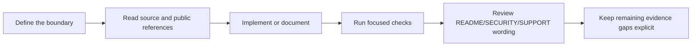

# AI-Native Development And Interview Script

AI was useful in this project, but not as an unchecked code generator. The
important part was putting AI into a loop that forces source reading, boundary
checks, focused verification, and public claim review.

## Development Loop

## What AI Helped With

AI helped with:

- breaking a broad product goal into smaller boundaries
- finding adjacent files and tests
- drafting documentation from source evidence
- checking for over-claiming language
- turning implementation work into interview-ready explanations

AI did not decide when the project was safe. Non-goals, public/private data
boundaries, release authority, and security claim upgrades remain human
judgment calls.

## 30-Second Introduction

Another Dimension Chat is a Rust/Tauri prototype for a high-risk 1:1 messenger
direction with no central trusted server in the product model. It excludes phone
identity, email identity, global accounts, central contact discovery, central
message servers, push notifications, and cloud backup from the v0.1 default
scope. The current beta is not a secure messenger; it is a project that makes
the boundary, evidence, and non-claims explicit.

## Five-Minute Demo Flow

1. Open [README.md](../README.md) and show the project direction, download
   status, what can be tested, and what is not claimed.
2. Open [Cargo.toml](../Cargo.toml) and show the Rust workspace shape.
3. Open [crates/pairing/src/lib.rs](../crates/pairing/src/lib.rs) and explain
   pairing payloads, canonical bytes, signatures, and safety material.
4. Open [crates/protocol/src/lib.rs](../crates/protocol/src/lib.rs) and explain
   envelopes and replay windows.
5. Open [crates/storage/src/lib.rs](../crates/storage/src/lib.rs) and
   [crates/transport/src/lib.rs](../crates/transport/src/lib.rs) to show local
   encrypted storage and fail-closed transport policy.
6. Open [scripts/verify_all.sh](../scripts/verify_all.sh) and explain how the
   project keeps boundary checks close to day-to-day development.

## Interview Questions

### Why build another chat app?

The value is not another chat UI. The value is the problem decomposition:
identity, contact discovery, delivery, storage, support, and release claims are
separated so the project can avoid stronger claims than the evidence supports.

### Why is manual envelope exchange the default?

It is less convenient, but it avoids implying automatic network delivery,
central message storage, push dependency, or reliable external onion delivery.
It makes the v0.1 trust boundary explicit.

### Why not just say it is a secure messenger?

Because that would exceed the current evidence. The project has useful
implementation boundaries and verification scripts, but it is not audited, not
production-ready, and not safe for sensitive communication.

### What does this show about AI-native engineering?

It shows the ability to use AI for speed while keeping final responsibility with
the engineer. AI can draft code and documents quickly, but the engineer must
verify behavior, redact public outputs, and prevent claim drift.
