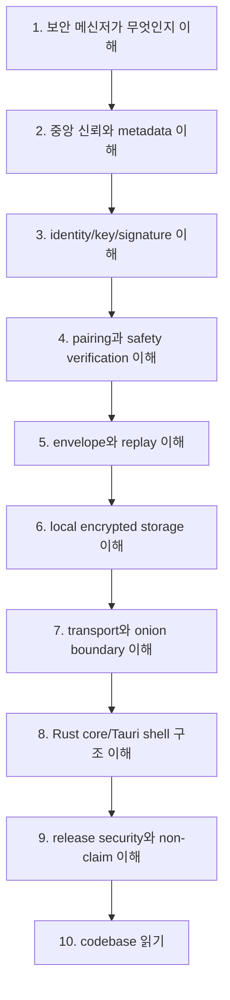

# 00. Reading Roadmap

이 문서는 초보자가 Another Dimension Chat의 기술 문서를 어떤 순서로 읽으면 좋은지 안내한다.

처음부터 [crates/core/src/lib.rs](../../crates/core/src/lib.rs) 같은 큰 파일을 열면 어렵다. 먼저 개념 지도를 만들고, 그 다음 source file을 연결해서 보는 편이 좋다.

## 전체 여정

## 레벨별 추천 경로

### Level 1. 보안 메신저를 처음 보는 사람

먼저 아래 세 글만 읽는다.

1. [01-what-is-a-secure-messenger.md](./01-what-is-a-secure-messenger.md)
2. [02-central-trust-and-metadata.md](./02-central-trust-and-metadata.md)
3. [glossary.md](./glossary.md)

이 단계의 목표는 "보안 메신저"가 단순히 message encryption 하나로 끝나지 않는다는 점을 이해하는 것이다.

### Level 2. 암호화와 pairing을 이해하고 싶은 사람

다음 세 글을 읽는다.

1. [03-identity-keys-and-signatures.md](./03-identity-keys-and-signatures.md)
2. [04-pairing-and-safety-verification.md](./04-pairing-and-safety-verification.md)
3. [05-encryption-envelope-and-replay.md](./05-encryption-envelope-and-replay.md)

이 단계의 목표는 "누구와 말하는가", "정말 그 사람인가", "메시지가 재전송 공격인지 아닌지"를 구분하는 것이다.

### Level 3. 제품 구조를 이해하고 싶은 사람

다음 세 글을 읽는다.

1. [06-local-encrypted-storage.md](./06-local-encrypted-storage.md)
2. [07-transport-manual-onion-and-network-boundaries.md](./07-transport-manual-onion-and-network-boundaries.md)
3. [08-tauri-shell-and-rust-core-boundary.md](./08-tauri-shell-and-rust-core-boundary.md)

이 단계의 목표는 보안 개념이 실제 앱 구조에서 어디에 들어가는지 이해하는 것이다.

### Level 4. 공개 release와 claim discipline을 이해하고 싶은 사람

마지막으로 아래 글을 읽는다.

1. [09-release-security-and-non-claims.md](./09-release-security-and-non-claims.md)
2. [10-how-to-read-the-codebase.md](./10-how-to-read-the-codebase.md)
3. [diagrams.md](./diagrams.md)

이 단계의 목표는 "무엇을 구현했는가"와 "무엇을 public claim할 수 있는가"를 분리하는 것이다.

## 핵심 파일 지도

초보자는 아래 순서로 보면 좋다.

| 순서 | 파일 | 먼저 볼 이유 |
| --- | --- | --- |
| 1 | [README.md](../../README.md) | public beta 상태와 non-claim을 먼저 확인 |
| 2 | [SECURITY.md](../../SECURITY.md) | 현재 보안 policy와 제한 확인 |
| 3 | [crates/protocol/src/lib.rs](../../crates/protocol/src/lib.rs) | envelope/replay 개념이 비교적 작게 모여 있음 |
| 4 | [crates/pairing/src/lib.rs](../../crates/pairing/src/lib.rs) | pairing payload와 safety transcript 확인 |
| 5 | [crates/identity/src/lib.rs](../../crates/identity/src/lib.rs) | profile/contact/key/signature type 확인 |
| 6 | [crates/storage/src/lib.rs](../../crates/storage/src/lib.rs) | local encrypted storage boundary 확인 |
| 7 | [crates/transport/src/lib.rs](../../crates/transport/src/lib.rs) | fail-closed transport policy 확인 |
| 8 | [crates/core/src/lib.rs](../../crates/core/src/lib.rs) | 여러 crate가 product flow로 조합되는 방식 확인 |
| 9 | [apps/desktop-tauri/src-tauri/src/lib.rs](../../apps/desktop-tauri/src-tauri/src/lib.rs) | Tauri command/Rust boundary 확인 |
| 10 | [apps/desktop-tauri/src/main.js](../../apps/desktop-tauri/src/main.js) | UI가 redacted status와 explicit action을 다루는 방식 확인 |

## 읽을 때 주의할 점

### 1. "암호화"와 "안전"은 다르다

암호화가 있어도 identity 확인, key 관리, replay 방지, local storage, endpoint compromise, user error, release integrity 문제가 남는다.

### 2. "서버 없음"과 "중앙 신뢰 없음"은 다르다

어떤 서버가 전혀 없다는 말보다, 어떤 중앙 서버도 identity/contact/message/backup을 신뢰 중심으로 잡지 않는다는 말이 더 정확하다.

### 3. "Tor/onion"과 "검열 저항"은 다르다

Tor/onion code path가 있어도 bootstrap, bridge, descriptor, lifecycle, external delivery evidence, field test가 없으면 censorship-resistant claim은 열리지 않는다.

### 4. "release artifact"와 "security proof"는 다르다

checksum, signing, notarization은 배포 integrity와 OS trust UX에 중요하지만, 그것만으로 secure messenger가 되지는 않는다.

## 이 guide를 다 읽은 뒤 할 수 있어야 하는 말

다 읽은 뒤에는 다음을 설명할 수 있어야 한다.

- 왜 이 프로젝트가 "서버 없는 채팅"이 아니라 no-central-trusted-server 방향인지
- 왜 phone/email/global account/contact discovery/push/cloud backup이 v0.1 non-goal인지
- public key/private key/signature/nonce가 pairing에 왜 필요한지
- safety verification이 왜 사용자 경험과 연결되는지
- message envelope와 replay window가 왜 필요한지
- local encrypted storage가 보호하는 것과 보호하지 못하는 것
- manual transport와 onion/Tor advanced path의 차이
- Tauri shell이 보안 의미를 소유하면 왜 위험한지
- checksum/signing/notarization/audit/production-ready의 차이
- source file을 어떤 순서로 읽으면 되는지
