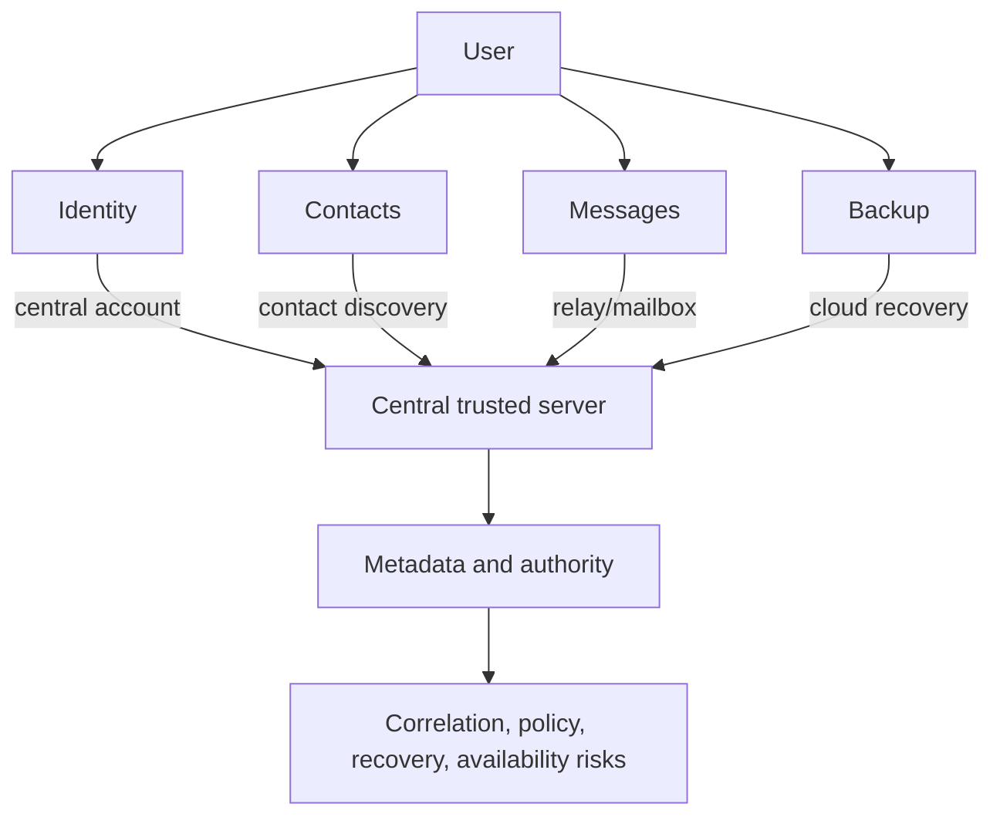

# 02. Central Trust And Metadata

## 이 글에서 배울 것

이 글은 "중앙 서버가 없다"보다 "중앙에서 무엇을 신뢰해야 하는가"가 더 중요하다는 점을 설명한다.

Another Dimension Chat의 목표는 모든 네트워크 인프라를 없애는 것이 아니다. release download, GitHub issue, vulnerability intake 같은 public infrastructure는 사용할 수 있다.

중요한 질문은 messenger product가 중앙 서버를 다음 용도로 신뢰하느냐다.

- identity 발급
- contact discovery
- message relay/storage
- push notification
- cloud backup/recovery
- account recovery
- abuse/policy decision

## 초보자용 비유

동아리 사람끼리 비밀 쪽지를 주고받는다고 생각해보자.

중앙 게시판이 있으면 편하다.

- 누가 동아리원인지 게시판에서 확인한다.
- 누구에게 보낼지 게시판에서 검색한다.
- 쪽지를 게시판 관리자가 맡아준다.
- 새 쪽지가 오면 관리자가 알려준다.
- 잃어버린 쪽지를 관리자가 복구해준다.

하지만 게시판 관리자는 많은 것을 알게 된다.

- 누가 동아리원인지
- 누가 누구를 찾는지
- 누가 언제 쪽지를 남기는지
- 누가 자주 연락하는지
- 누가 복구를 요청하는지

중앙 서버도 비슷하다. 메시지 내용을 못 읽더라도 metadata와 authority가 생길 수 있다.

## 정확한 기술 개념

### Central Trust

Central trust는 시스템이 중앙 entity를 믿어야만 동작하는 구조다.

중앙 entity가 message content를 읽지 못해도 다음 권한을 가질 수 있다.

- 누가 서비스 사용자라고 말할 권한
- 누가 누구를 찾을 수 있는지 결정할 권한
- 메시지를 저장/삭제/전달할 권한
- push notification을 보낼 권한
- account recovery를 처리할 권한

### Metadata

Metadata는 message content가 아닌 주변 정보다.

예:

- account id
- phone/email hash
- contact graph
- login time
- IP address
- message timestamp
- message size
- delivery status
- device count
- backup status

E2EE가 있어도 metadata는 남을 수 있다.

### Contact Discovery

Contact discovery는 "내가 아는 사람이 이 서비스에 있는지" 찾는 기능이다.

대표적인 방식은 address book upload다. 이 방식은 편하지만 server가 social graph를 추론할 수 있다.

### Push Notification

Push notification은 mobile OS와 push provider를 통해 새 메시지를 알려주는 기능이다.

편리하지만 push provider, app server, device token, timing metadata가 얽힌다.

### Cloud Backup

Cloud backup은 복구성을 높이지만 backup key와 recovery authority 문제가 생긴다.

보안 메신저에서 backup은 특히 어렵다. 사용자가 passphrase를 잊었을 때 누가 복구할 수 있는지, backup provider가 무엇을 볼 수 있는지 정해야 한다.

## 이 프로젝트에서는 어떻게 쓰는가

Another Dimension Chat은 v0.1 기본값에서 다음을 제외한다.

- 전화번호 identity
- 이메일 identity
- global account
- searchable username
- central contact discovery
- central message server
- push notification
- cloud backup

이것은 "절대 영원히 안 한다"는 뜻이 아니다. v0.1에서 기본 trust boundary를 흐리지 않기 위한 product constraint다.

## Central Trust Map



Another Dimension Chat의 방향은 이 central server box에 들어가는 기본 기능을 줄이는 것이다.

## 관련 코드/문서

- `README.md`
- `SECURITY.md`
- `reference/PUBLIC_THREAT_MODEL.md`
- `reference/PRIVACY_MODEL_COMPARISON.md`
- `reference/PRODUCTION_DEFAULT_TRANSPORT_PATH.md`

## 흔한 오해

### 오해 1. 중앙 서버는 항상 나쁘다

아니다. 중앙 서버는 usability, spam control, offline delivery, account recovery에 큰 도움을 준다. 문제는 어떤 정보를 맡기고 어떤 권한을 주는지다.

### 오해 2. 메시지만 암호화하면 중앙 서버가 아무것도 모른다

아니다. 서버는 message content를 읽지 못해도 timing, size, sender/receiver relation, delivery status를 알 수 있다.

### 오해 3. Contact discovery는 작은 기능이다

아니다. contact discovery는 social graph를 다룬다. privacy-sensitive system에서는 큰 기능이다.

### 오해 4. Cloud backup은 단순 convenience다

아니다. backup은 key recovery, account recovery, provider trust와 연결된다. 잘못 설계하면 E2EE 의미를 약하게 만들 수 있다.

## 아직 claim하지 않는 것

이 프로젝트는 다음을 claim하지 않는다.

- 완전한 metadata protection
- anonymous messaging
- censorship resistance
- reliable offline delivery
- multi-device sync
- cloud backup recovery
- serverless라는 단어만으로 privacy 보장

## 직접 확인해볼 파일/명령

```bash
rg -n "phone|email|contact discovery|message server|push|cloud backup" README.md SECURITY.md reference
rg -n "central|metadata|trusted server" README.md SECURITY.md reference
```

검색 결과에서 어떤 문구가 goal이고 어떤 문구가 non-goal인지 확인한다.

## 요약

중앙 서버를 줄인다는 말은 "인터넷 인프라를 하나도 쓰지 않는다"는 뜻이 아니다. 핵심은 identity, contact discovery, message delivery, push, backup 같은 messenger authority를 중앙 서버에 맡기지 않는 것이다. Another Dimension Chat은 그 방향을 v0.1 product constraint로 삼고, 편의 기능보다 trust boundary를 먼저 명확히 한다.
