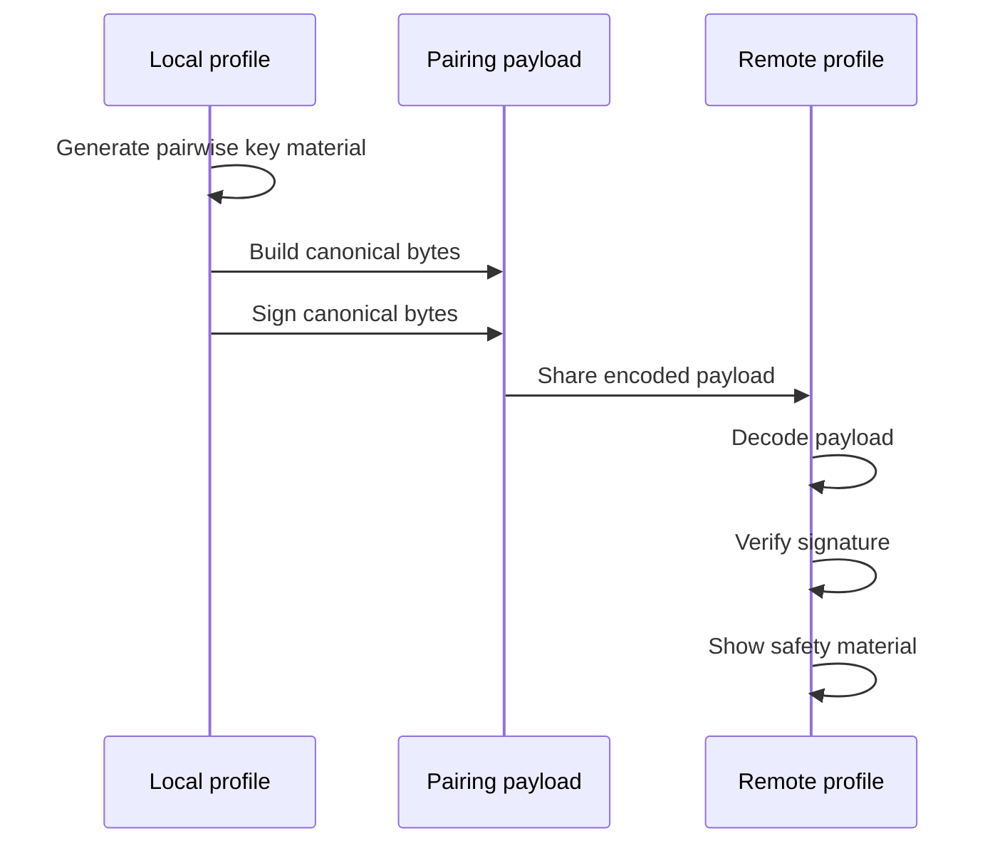

# 03. Identity, Keys, And Signatures

## 이 글에서 배울 것

이 글은 identity, public key, private key, signature, nonce가 무엇인지 설명한다.

보안 메신저에서 "상대방"은 단순 username이 아니다. 실제로는 어떤 key를 가진 device 또는 profile과 연결된다.

초보자가 반드시 구분해야 할 질문은 세 가지다.

1. 이 message를 누가 만들었는가?
2. 이 key가 정말 내가 생각한 사람의 key인가?
3. 이 payload가 중간에 바뀌지 않았는가?

## 초보자용 비유

도장을 생각해보자.

- private key는 나만 가진 도장이다.
- public key는 남들이 내 도장을 확인할 수 있는 도장 모양 설명서다.
- signature는 문서에 찍힌 도장 자국이다.
- verification은 도장 자국이 설명서와 맞는지 확인하는 과정이다.

하지만 중요한 문제가 남는다.

도장 자국이 어떤 도장과 맞는지는 확인할 수 있어도, 그 도장이 정말 내가 아는 친구의 도장인지는 별도로 확인해야 한다.

이것이 key verification과 safety verification이 필요한 이유다.

## 정확한 기술 개념

### Identity

Identity는 상대를 식별하는 정보다.

일반 앱에서는 phone number, email, username이 identity 역할을 한다. 하지만 보안 메신저에서는 cryptographic identity, 즉 key와 연결된 identity가 중요하다.

### Public Key

Public key는 공개해도 되는 key다.

public key는 다음에 쓰일 수 있다.

- signature 검증
- key agreement
- 상대 identity 표현

public key는 공개 가능하지만, 이 key가 누구의 것인지 확인하는 절차가 필요하다.

### Private Key

Private key는 절대 외부에 공개하면 안 되는 key다.

private key는 다음에 쓰일 수 있다.

- signature 생성
- decrypt
- key agreement

private key가 유출되면 공격자가 나를 가장하거나 과거/미래 session에 영향을 줄 수 있다. 어떤 피해가 가능한지는 protocol 설계에 따라 달라진다.

### Signature

Signature는 private key로 만든 증명이다.

public key를 가진 사람은 signature가 해당 private key로 만들어졌는지 확인할 수 있다.

signature가 보장하는 것:

- payload가 해당 private key 소유자에 의해 서명되었다.
- payload가 서명 후 바뀌지 않았다.

signature가 보장하지 않는 것:

- private key 소유자가 현실 세계의 누구인지
- 해당 device가 compromise되지 않았는지
- 사용자가 안전하게 verify했는지

### Nonce

Nonce는 한 번만 쓰이는 값이다.

nonce는 payload freshness, 중복 방지, replay 완화에 도움을 준다. 하지만 nonce 하나만으로 replay attack이 모두 해결되는 것은 아니다.

### Canonical Bytes

Canonical bytes는 "서명할 payload를 정확히 어떤 byte 순서로 표현할 것인가"에 대한 고정된 형식이다.

같은 의미의 data라도 serialization 방식이 다르면 signature 검증이 실패할 수 있다. 그래서 signature 대상은 canonical하게 만들어야 한다.

## 이 프로젝트에서는 어떻게 쓰는가

관련 source:

- `crates/identity/src/lib.rs`
- `crates/pairing/src/lib.rs`

`crates/identity`는 profile/contact/key/signature type을 다룬다.

`crates/pairing`은 pairing payload에 public key, signature, nonce, endpoint policy, protocol capabilities 등을 넣고 canonical bytes에 signature를 붙인다.

핵심 흐름:



## 관련 코드 파일

확인할 anchor:

- `crates/identity/src/lib.rs`: `ProfileName`, `ContactId`, `PairwisePublicKey`, `ProductionPairwisePrivateKey`
- `crates/pairing/src/lib.rs`: `PairingPayload`, `canonical_bytes`, `production_pairing_payload_for`, `production_pairing_nonce`

처음 읽을 때는 함수 구현을 완전히 이해하려고 하지 않아도 된다. 먼저 type 이름이 어떤 책임을 나누는지 보면 된다.

## 흔한 오해

### 오해 1. Public key는 비밀이어야 한다

아니다. public key는 공개 가능한 key다. 다만 public key가 누구의 것인지 확인하는 것이 중요하다.

### 오해 2. Signature가 있으면 상대방 신원이 완전히 확인된다

아니다. signature는 "이 private key가 sign했다"를 보여준다. 그 key가 정말 내 친구의 key인지는 safety verification과 trust process가 필요하다.

### 오해 3. Nonce가 있으면 replay 문제는 끝난다

아니다. nonce는 도움이 되지만, message number, replay window, durable state 같은 protocol state가 함께 필요하다.

### 오해 4. Key를 만들었으니 production key management가 끝났다

아니다. key generation, storage, rotation, deletion, backup, device migration, compromise recovery는 모두 별도 문제다.

## 아직 claim하지 않는 것

현재 프로젝트는 다음을 claim하지 않는다.

- audited key lifecycle
- complete key rotation
- full device compromise recovery
- production-grade multi-device identity
- hardware-backed key protection
- global identity verification

## 직접 확인해볼 파일/명령

```bash
rg -n "pub struct ProfileName|pub struct ContactId|PairwisePublicKey|ProductionPairwisePrivateKey" crates/identity/src/lib.rs
rg -n "pub struct PairingPayload|canonical_bytes|production_pairing_payload_for|production_pairing_nonce" crates/pairing/src/lib.rs
```

## 요약

보안 메신저에서 identity는 username보다 깊다. public key, private key, signature, nonce, canonical bytes가 함께 있어야 "어떤 key가 어떤 payload를 만들었는가"를 확인할 수 있다. 하지만 그 key가 실제로 내가 믿는 사람의 key인지 확인하려면 pairing과 safety verification이 필요하다.
