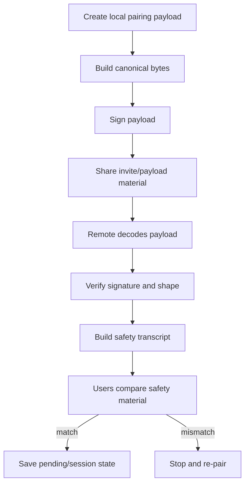

# 04. Pairing And Safety Verification

## 이 글에서 배울 것

이 글은 pairing과 safety verification을 설명한다.

Pairing은 두 사용자가 앞으로 대화할 상대를 등록하는 과정이다. 하지만 보안 메신저에서 pairing은 단순히 "친구 추가"가 아니다.

pairing은 다음 질문을 다룬다.

- 상대방의 key material을 어떻게 받는가?
- payload가 중간에 바뀌지 않았는가?
- payload가 너무 오래되거나 너무 큰가?
- 양쪽이 같은 session material을 보고 있는가?
- 사용자가 직접 확인할 수 있는 safety material이 있는가?

## 초보자용 비유

처음 만난 사람과 암호 편지를 주고받기로 했다고 생각해보자.

상대가 "이 암호표를 쓰자"고 종이를 준다. 그런데 종이를 중간에서 누군가 바꿨을 수 있다.

그래서 다음이 필요하다.

- 종이가 일정한 형식인지 확인한다.
- 종이에 찍힌 signature를 확인한다.
- 종이가 너무 오래된 것이 아닌지 확인한다.
- 마지막으로 둘이 직접 만나 safety number나 phrase를 비교한다.

이 마지막 "직접 비교"가 중요한 이유는 cryptography만으로 현실 세계의 사람을 자동으로 확인할 수 없기 때문이다.

## 정확한 기술 개념

### Pairing Payload

Pairing payload는 상대와 연결하기 위해 교환하는 자료다.

이 프로젝트의 pairing payload에는 conceptually 다음이 들어간다.

- owner profile
- pairing nonce
- pairwise public key
- pairwise signature
- rendezvous endpoint
- endpoint rotation policy
- protocol capabilities
- prekey bundle
- issued time
- TTL

이 값들은 그냥 문자열로 던지는 것이 아니라 canonical bytes로 만든 뒤 signature 검증 boundary를 가진다.

### TTL

TTL은 time-to-live다. payload가 너무 오래된 경우 거부할 수 있게 한다.

TTL은 replay risk를 줄이는 데 도움을 준다. 하지만 TTL만으로 모든 replay나 stale endpoint 문제가 해결되는 것은 아니다.

### Safety Transcript

Safety transcript는 양쪽 pairing payload에서 중요한 material을 뽑아 사용자 확인용으로 묶은 것이다.

목표는 양쪽 사용자가 같은 cryptographic context를 보고 있는지 확인하는 것이다.

### Safety Number / Safety Phrase

사용자가 직접 비교할 수 있는 형태의 safety material이다.

예:

- 숫자 그룹
- 짧은 단어 phrase
- QR code
- fingerprint

어떤 UI를 쓰든 핵심은 사용자가 out-of-band 방식으로 비교할 수 있어야 한다는 점이다.

## 이 프로젝트에서는 어떻게 쓰는가

관련 source:

- `crates/pairing/src/lib.rs`
- `crates/identity/src/lib.rs`
- `crates/core/src/lib.rs`

핵심 흐름:



`PairingPayload`는 pairing 정보를 모은다. `canonical_bytes`는 signature 대상이 되는 고정 representation을 만든다. `transcript`는 local/remote payload를 묶어 safety material로 연결한다.

## 관련 코드 파일

처음 볼 anchor:

- `crates/pairing/src/lib.rs`: `PairingPayload`
- `crates/pairing/src/lib.rs`: `canonical_bytes`
- `crates/pairing/src/lib.rs`: `production_pairing_payload_for`
- `crates/pairing/src/lib.rs`: `transcript`
- `crates/pairing/src/lib.rs`: `verify_pairing_signature`
- `crates/core/src/lib.rs`: pairing session prepare/save/status 관련 summary

## 흔한 오해

### 오해 1. Invite code만 있으면 안전하게 상대를 추가한 것이다

아니다. invite code나 payload는 trust bootstrap의 일부일 뿐이다. signature와 safety verification이 필요하다.

### 오해 2. Signature verification이 성공하면 사람이 확인할 필요가 없다

아니다. signature는 key-level proof다. 그 key가 내가 생각하는 사람의 것인지는 safety verification과 user trust가 필요하다.

### 오해 3. Safety phrase는 장식 UI다

아니다. safety phrase/number는 cryptographic context를 사용자 확인 행동으로 연결하는 중요한 UX다.

### 오해 4. Pairing이 한 번 끝나면 endpoint 문제도 끝난다

아니다. endpoint는 바뀔 수 있다. endpoint rotation, stale endpoint, endpoint authentication 같은 문제가 남는다.

## 아직 claim하지 않는 것

현재 프로젝트는 다음을 claim하지 않는다.

- audited pairing protocol
- perfect MITM prevention in all user scenarios
- complete re-pairing/revocation UX
- production-grade contact verification
- social recovery or account recovery

## 직접 확인해볼 파일/명령

```bash
rg -n "PairingPayload|canonical_bytes|transcript|verify_pairing_signature|ttl" crates/pairing/src/lib.rs
rg -n "ProductionPairingSession.*Summary|pairing.*status|pairing.*save" crates/core/src/lib.rs
```

## 요약

Pairing은 친구 추가가 아니라 trust bootstrap이다. payload shape, canonical bytes, signature, TTL, safety transcript, user comparison이 함께 있어야 한다. Another Dimension Chat은 이 boundary를 구현하고 설명하지만, 아직 audited pairing protocol이라고 claim하지 않는다.
