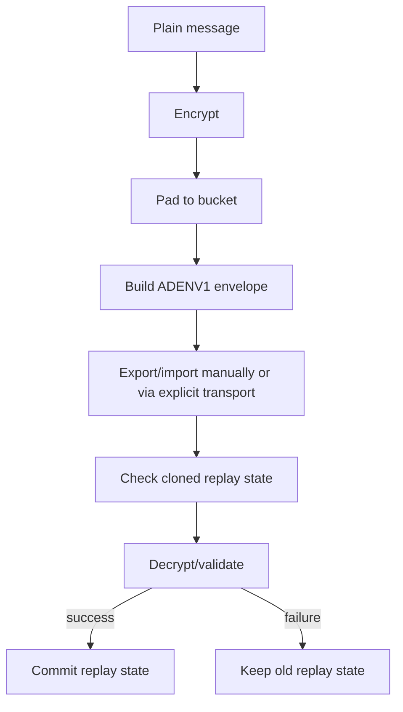

# 05. Encryption Envelope And Replay

## 이 글에서 배울 것

이 글은 encrypted envelope와 replay window를 설명한다.

초보자는 보통 "메시지를 암호화해서 보내면 된다"고 생각한다. 하지만 실제 protocol에서는 다음 문제가 생긴다.

- 메시지의 순서를 어떻게 알 것인가?
- 같은 메시지가 두 번 들어오면 어떻게 할 것인가?
- 과거 메시지를 공격자가 다시 보내면 어떻게 할 것인가?
- 잘못된 ciphertext 때문에 replay state가 망가지면 어떻게 할 것인가?
- message size가 너무 많이 드러나면 어떻게 할 것인가?

## 초보자용 비유

택배 상자를 생각해보자.

상자 안에는 비밀 물건이 들어 있고, 상자는 잠겨 있다. 하지만 상자 겉면에는 배송에 필요한 정보가 있다.

- 배송 번호
- 보낸 순서
- 물건 종류
- 상자 크기

상자 안을 못 봐도, 누군가 같은 상자를 다시 가져올 수 있다. 그러면 받는 사람은 "이미 받은 상자"인지 확인해야 한다.

encrypted envelope와 replay window도 비슷하다.

## 정확한 기술 개념

### Plaintext

Plaintext는 암호화 전 원문이다.

보안 문서나 public issue에는 plaintext message를 넣으면 안 된다.

### Ciphertext

Ciphertext는 암호화 후 데이터다.

ciphertext를 보더라도 원문을 읽기 어려워야 한다. 하지만 ciphertext size나 timing은 metadata로 남을 수 있다.

### Envelope

Envelope는 message를 protocol이 처리할 수 있게 감싼 구조다.

이 프로젝트의 protocol envelope는 conceptually 다음을 가진다.

- protocol version
- channel id
- message number
- message type
- padded ciphertext

### Padding Bucket

Padding bucket은 payload size를 일정한 bucket으로 맞추는 방식이다.

예를 들어 300 byte message를 512 byte bucket으로 맞추면 정확한 message size가 덜 드러난다. 하지만 traffic analysis 전체를 막는 것은 아니다.

### Message Number

Message number는 메시지 순서와 replay detection에 쓰인다.

message number가 없으면 같은 ciphertext가 다시 들어왔는지, 너무 오래된 message인지 판단하기 어렵다.

### Replay Attack

Replay attack은 과거에 봤던 메시지를 다시 보내 receiver를 속이는 공격이다.

암호화가 있어도 replay attack은 가능할 수 있다. 공격자는 message content를 몰라도 ciphertext를 복사해 다시 보낼 수 있기 때문이다.

### Replay Window

Replay window는 최근에 본 message number를 기억한다.

보통 다음을 거부한다.

- message number 0 같은 invalid number
- 이미 본 number
- window 밖으로 너무 오래된 number

### Commit After Decrypt

중요한 rule:

> replay state는 decrypt/validation이 성공한 뒤에 commit해야 한다.

왜냐하면 공격자가 corrupted ciphertext를 먼저 보내 특정 message number를 소비하게 만들 수 있기 때문이다. 그 상태가 먼저 commit되면 나중에 정상 ciphertext가 와도 replay로 거부될 수 있다.

## 이 프로젝트에서는 어떻게 쓰는가

관련 source:

- `crates/protocol/src/lib.rs`
- `crates/core/src/lib.rs`

핵심 흐름:



`Envelope`는 protocol-level message wrapper다. `ReplayWindow`는 message number state를 관리한다. `accept_after_decrypt`는 replay state commit timing을 표현한다.

## 관련 코드 파일

처음 볼 anchor:

- `crates/protocol/src/lib.rs`: `Envelope`
- `crates/protocol/src/lib.rs`: `pad_to_bucket`
- `crates/protocol/src/lib.rs`: `ReplayWindow`
- `crates/protocol/src/lib.rs`: `accept_after_decrypt`
- `crates/protocol/src/lib.rs`: `encode_state` / `decode_state`
- `crates/core/src/lib.rs`: production receive/replay persistence 관련 tests

## 흔한 오해

### 오해 1. Ciphertext는 복사되어도 쓸모없다

아니다. 공격자가 ciphertext 내용을 몰라도 replay할 수 있다. receiver가 duplicate를 감지해야 한다.

### 오해 2. Message number만 있으면 replay 문제가 끝난다

아니다. message number를 어떻게 저장하고 언제 commit하는지가 중요하다.

### 오해 3. Padding이 있으면 metadata가 사라진다

아니다. padding은 size leak을 줄일 뿐이다. timing, sender/receiver relation, network path metadata는 남을 수 있다.

### 오해 4. Replay rejection은 UX와 무관하다

아니다. 잘못 설계하면 정상 메시지가 사라지거나 duplicate import가 이상하게 보일 수 있다. protocol behavior와 user recovery가 연결된다.

## 아직 claim하지 않는 것

현재 프로젝트는 다음을 claim하지 않는다.

- audited E2EE protocol
- complete traffic analysis resistance
- production delivery reliability
- malicious endpoint compromise protection
- all reorder/offline/multi-device scenarios complete

## 직접 확인해볼 파일/명령

```bash
rg -n "pub struct Envelope|pad_to_bucket|pub struct ReplayWindow|accept_after_decrypt|encode_state|decode_state" crates/protocol/src/lib.rs
rg -n "replay|tamper|decrypt|message_number" crates/core/src/lib.rs
```

## 요약

Encrypted envelope는 원문 message를 protocol이 처리할 수 있는 단위로 감싼다. Replay window는 duplicate나 오래된 message를 막는다. 가장 중요한 점은 실패한 decrypt가 replay state를 오염시키지 않도록 성공 후 commit하는 것이다. 이 boundary는 중요하지만, 그 자체가 audited production E2EE claim은 아니다.
