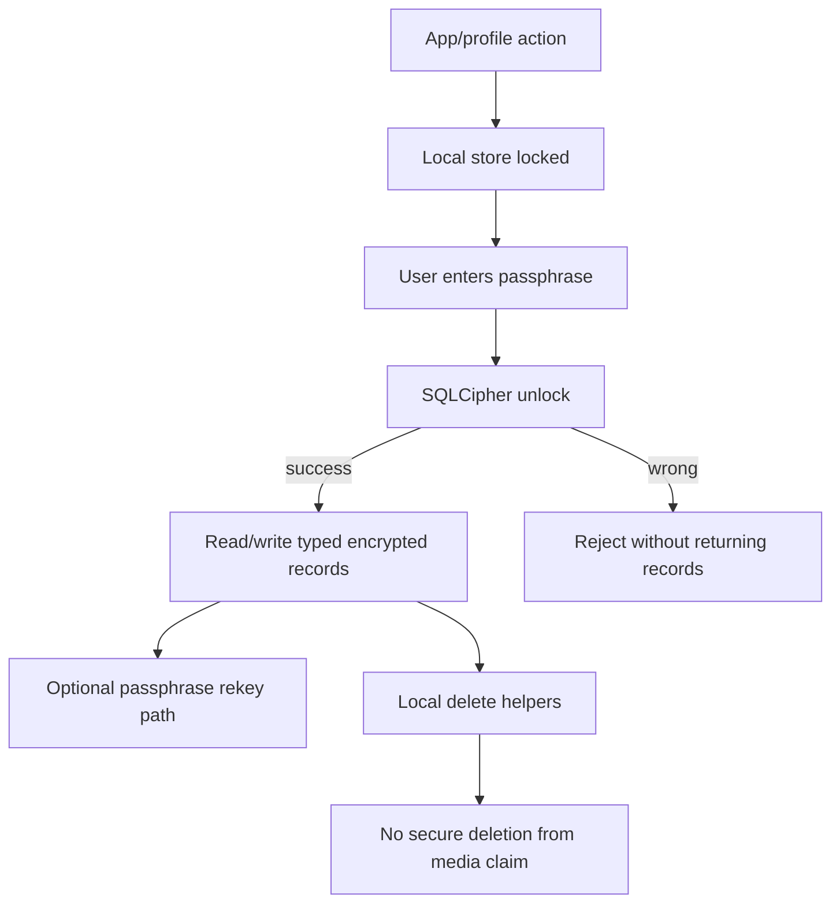

# 06. Local Encrypted Storage

## 이 글에서 배울 것

이 글은 local encrypted storage를 설명한다.

보안 메신저는 메시지를 전송할 때만 안전하면 되는 것이 아니다. 사용자의 device 안에 남는 profile, session, message, replay state도 다뤄야 한다.

초보자가 구분해야 할 질문은 다음이다.

- 앱 data는 어디에 저장되는가?
- 저장된 data는 암호화되는가?
- unlock에는 무엇이 필요한가?
- passphrase가 틀리면 record를 반환하지 않는가?
- 삭제는 어떤 수준의 삭제인가?
- rollback이나 old database restore를 막는가?
- cloud backup이나 OS sync와 어떤 관계인가?

## 초보자용 비유

잠긴 서랍을 생각해보자.

서랍에 편지를 넣고 자물쇠를 잠그면 편지는 더 안전해진다. 하지만 이것이 모든 문제를 해결하지는 않는다.

- 열쇠가 약하면 쉽게 열린다.
- 누가 서랍 전체를 예전 상태로 바꿔치기할 수 있다.
- 편지를 찢어 버려도 종이 조각이 어딘가 남을 수 있다.
- 누군가 서랍을 통째로 cloud에 복사할 수 있다.
- 열쇠를 잊어버리면 복구가 어렵다.

local encrypted storage도 비슷하다.

## 정확한 기술 개념

### Local Store

Local store는 사용자의 device 안에 저장되는 data 저장소다.

메신저에서는 다음이 local store에 들어갈 수 있다.

- profile metadata
- contact/session state
- encrypted message records
- replay window state
- endpoint state
- user preferences

### SQLCipher

SQLCipher는 SQLite database를 암호화하는 기술이다.

SQLite는 local database이고, SQLCipher는 그 database page를 암호화한다. Passphrase나 key 없이는 database 내용을 읽기 어렵게 만드는 것이 목적이다.

### Passphrase-First Unlock

Passphrase-first unlock은 사용자가 passphrase를 입력해야 store가 열리는 구조다.

이 프로젝트에서 중요한 원칙:

> wrong passphrase일 때 record를 반환하면 안 된다.

### Record Kind

Record kind는 저장된 record가 어떤 종류인지 구분하는 값이다.

예:

- profile state
- session state
- message envelope
- replay window state
- local message index

Record kind가 있으면 storage layer가 단순 blob 저장소가 아니라 product state boundary를 표현할 수 있다.

### Rekey

Rekey는 passphrase나 encryption key를 바꾸는 작업이다.

주의할 점: rekey source path가 있다고 해서 "complete key rotation" claim이 자동으로 열리지 않는다. 전체 app data, key hierarchy, rollback marker, old backup, migration UX를 함께 봐야 한다.

### Deletion

Deletion에는 여러 수준이 있다.

- UI에서 보이지 않게 하는 deletion
- database row를 제거하는 deletion
- encrypted file에서 record를 제거하는 deletion
- storage media에서 복구 불가능하게 지우는 secure deletion

마지막 secure deletion은 OS/filesystem/SSD behavior 때문에 매우 어렵다. 그래서 쉽게 claim하면 안 된다.

### Rollback

Rollback은 공격자나 환경이 database를 예전 상태로 되돌리는 문제다.

예를 들어 replay window state가 예전으로 돌아가면 이미 받은 message를 다시 받는 문제가 생길 수 있다.

Rollback detection과 rollback prevention은 다르다. marker가 있다고 prevention이 완성되는 것은 아니다.

## 작은 fake example

아래는 local encrypted store가 conceptually 다루는 record 예시다. 실제 database dump가 아니다.

| record id | kind | 저장 목적 | public issue에 올려도 되는가 |
| --- | --- | --- | --- |
| `profile_FAKE` | profile state | local profile 상태 | 아니오 |
| `pairing_FAKE` | pairing payload | pending/session bootstrap | 아니오 |
| `replay_FAKE` | replay window state | duplicate import 방지 | 아니오 |
| `message_FAKE` | message envelope | encrypted local message record | 아니오 |
| `diagnostics_FAKE` | redacted summary | support용 상태 요약 | private field 제거 후에만 가능 |

초보자가 봐야 할 포인트는 "encrypted at rest"가 있다고 해서 모든 record를 공개해도 된다는 뜻이 아니라는 점이다. encrypted record, local path, payload, key material, passphrase는 public support에 올리면 안 된다.

## 이 프로젝트에서는 어떻게 쓰는가

관련 source:

- [crates/storage/src/lib.rs](../../crates/storage/src/lib.rs)
- [crates/core/src/lib.rs](../../crates/core/src/lib.rs)
- [apps/desktop-tauri/src-tauri/src/lib.rs](../../apps/desktop-tauri/src-tauri/src/lib.rs)

핵심 흐름:



## 관련 코드 파일

처음 볼 anchor:

- [crates/storage/src/lib.rs](../../crates/storage/src/lib.rs): `ProductionRecordKind`
- [crates/storage/src/lib.rs](../../crates/storage/src/lib.rs): `StorageProtection`
- [crates/storage/src/lib.rs](../../crates/storage/src/lib.rs): `ReplayRollbackProtection`
- [crates/storage/src/lib.rs](../../crates/storage/src/lib.rs): `SqlCipherRecordStore`
- [crates/storage/src/lib.rs](../../crates/storage/src/lib.rs): `unlock_with_passphrase`
- [crates/storage/src/lib.rs](../../crates/storage/src/lib.rs): `rekey_with_passphrase`
- [crates/storage/src/lib.rs](../../crates/storage/src/lib.rs): delete helpers

Core 연결:

- [crates/core/src/lib.rs](../../crates/core/src/lib.rs): message/session/replay state를 storage record로 저장하는 flow

Desktop 연결:

- [apps/desktop-tauri/src-tauri/src/lib.rs](../../apps/desktop-tauri/src-tauri/src/lib.rs): desktop platform boundary, redacted diagnostics, local data lifecycle controls

## 흔한 오해

### 오해 1. SQLCipher를 쓰면 모든 local security가 끝난다

아니다. SQLCipher는 중요한 storage encryption layer다. 하지만 passphrase quality, key rotation, rollback, deletion, backup, migration 문제가 남는다.

### 오해 2. Delete 버튼이 있으면 secure deletion이다

아니다. local delete와 secure deletion from media는 다르다. SSD wear leveling, filesystem journaling, backups 때문에 secure deletion claim은 매우 어렵다.

### 오해 3. Passphrase rekey가 있으면 complete key rotation이다

아니다. rekey는 중요한 source path지만 complete key rotation은 broader lifecycle이다.

### 오해 4. Cloud backup을 끄면 backup 문제가 사라진다

아니다. OS sync location, user manual copy, Time Machine 같은 환경도 생각해야 한다.

## 아직 claim하지 않는 것

현재 프로젝트는 다음을 claim하지 않는다.

- secure deletion from media
- rollback prevention
- complete key rotation
- cloud backup recovery
- hardware-backed key storage
- audited key lifecycle
- endpoint compromise recovery

## 직접 확인해볼 파일/명령

```bash
rg -n "ProductionRecordKind|StorageProtection|ReplayRollbackProtection|SqlCipherRecordStore|unlock_with_passphrase|rekey_with_passphrase|delete_replay_window" crates/storage/src/lib.rs
rg -n "wrong_passphrase|delete|rekey|rollback" crates/storage/src/lib.rs
```

## 요약

Local encrypted storage는 device 안에 남는 state를 보호하기 위한 중요한 boundary다. 하지만 SQLCipher, passphrase unlock, delete helper, rekey path가 있다고 해서 secure deletion, rollback prevention, complete key rotation, cloud recovery claim이 자동으로 열리지는 않는다. 이 프로젝트는 그 차이를 명확히 유지한다.
