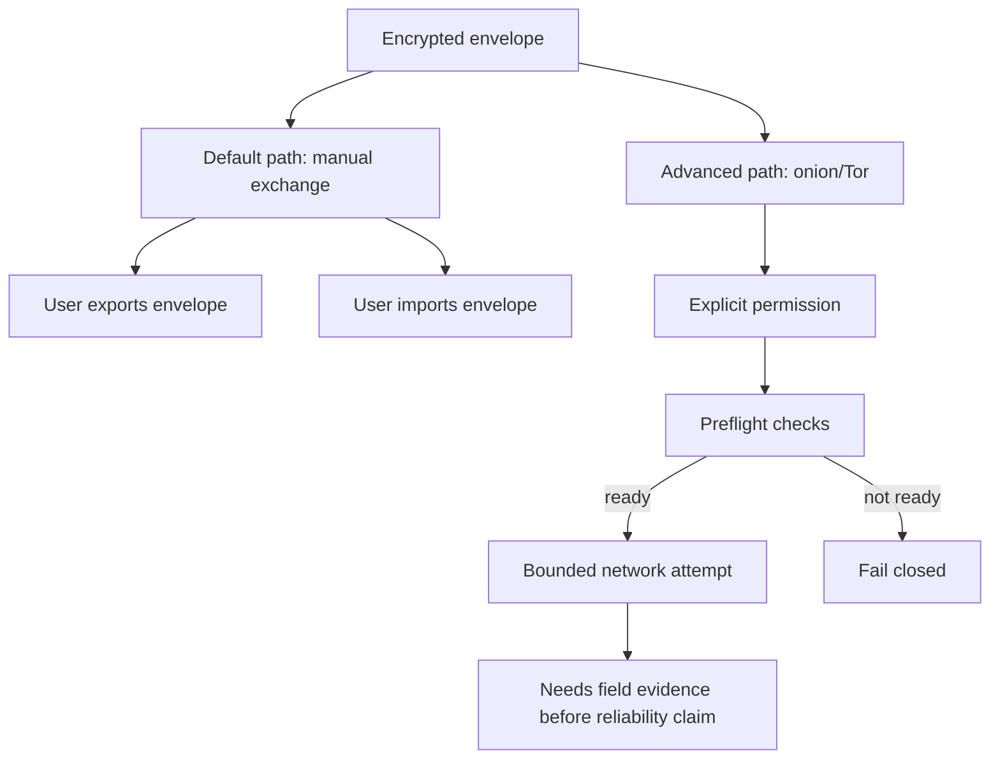

# 07. Transport, Manual Exchange, Onion, And Network Boundaries

## 이 글에서 배울 것

이 글은 transport를 설명한다.

Transport는 encrypted envelope를 한쪽 사용자에서 다른 쪽 사용자에게 옮기는 방식이다.

보안 메신저에서 transport는 매우 중요하다. transport가 다음을 결정할 수 있기 때문이다.

- 누가 누구에게 보내는지 metadata가 어디에 남는가?
- offline delivery가 가능한가?
- network failure가 어떻게 보이는가?
- 중앙 server나 relay가 필요한가?
- Tor/onion 같은 privacy network를 쓸 때 어떤 claim이 가능한가?

## 초보자용 비유

암호화된 편지를 만들었다고 생각해보자.

이제 편지를 전달해야 한다. 전달 방법은 여러 가지다.

- 직접 손으로 건넨다.
- 우편함에 넣는다.
- 친구에게 전달을 부탁한다.
- 익명 우편 서비스를 쓴다.
- 게시판에 올리고 상대가 가져가게 한다.

편지 내용은 암호화되어 있어도, 전달 방식에 따라 누가 누구와 연락하는지, 언제 보냈는지, 얼마나 자주 보내는지 정보가 남을 수 있다.

## 정확한 기술 개념

### Transport

Transport는 message를 이동시키는 layer다.

Transport는 encryption 자체와 다르다. 암호화된 envelope를 어떻게 옮길지 정하는 것이다.

### Manual Envelope Exchange

Manual envelope exchange는 사용자가 encrypted envelope를 직접 export/import하는 방식이다.

장점:

- default path에서 central message server가 필요 없다.
- push notification dependency가 없다.
- app launch network activity를 피할 수 있다.
- delivery claim을 과장하기 어렵다.

단점:

- UX가 불편하다.
- offline delivery가 자동으로 되지 않는다.
- 사용자가 export/import 실수를 할 수 있다.

### Relay Server

Relay server는 message를 대신 전달하는 서버다.

편리하지만 relay metadata, availability, abuse policy, retention, delivery authority 문제가 생긴다.

### Onion/Tor Path

Onion/Tor path는 Tor network를 통해 endpoint를 숨기거나 직접 연결하는 방향이다.

하지만 Tor/onion을 쓴다고 자동으로 다음이 보장되는 것은 아니다.

- reliable delivery
- censorship resistance
- anonymity against all attackers
- bridge readiness
- descriptor publication reliability
- stream lifecycle correctness

### Bootstrap

Bootstrap은 Tor client가 network에 연결되고 사용할 준비가 되는 과정이다.

bootstrap이 실패하면 onion path는 동작하지 않는다. 이것을 UX와 recovery로 다뤄야 한다.

### Descriptor

Descriptor는 onion service를 찾기 위한 network metadata다.

descriptor publication, fetch, expiry, rotation, failure handling은 모두 별도 문제다.

### Fail-Closed

Fail-closed는 준비가 안 되었을 때 위험한 network action을 하지 않고 멈추는 방식이다.

이 프로젝트에서는 advanced onion/Tor path가 explicit user action과 preflight 없이 자동으로 network work를 시작하면 안 된다.

## 작은 fake example

아래 세 상황은 모두 encrypted envelope를 옮기는 방식이지만 claim이 다르다.

| 상황 | 사용자가 한 일 | 가능한 설명 | 하면 안 되는 claim |
| --- | --- | --- | --- |
| Manual export/import | Alice가 envelope text를 export하고 Bob이 import | default manual exchange가 동작했다 | claim 금지: automatic delivery |
| Onion attempt blocked | 사용자가 permission을 켜지 않음 | fail-closed로 network work를 시작하지 않았다 | claim 금지: security proof |
| Onion attempt tried | 사용자가 permission을 켜고 preflight 통과 | bounded advanced network attempt를 했다 | claim 금지: reliable external onion delivery |

이 차이가 중요한 이유는 transport success와 protocol encryption success가 서로 다른 증거이기 때문이다.

## 이 프로젝트에서는 어떻게 쓰는가

관련 source:

- [crates/transport/src/lib.rs](../../crates/transport/src/lib.rs)
- [apps/desktop-tauri/src-tauri/src/lib.rs](../../apps/desktop-tauri/src-tauri/src/lib.rs)
- [apps/desktop-tauri/src/main.js](../../apps/desktop-tauri/src/main.js)

핵심 transport decision:



Default path는 manual encrypted envelope exchange다.

Advanced onion/Tor path는 다음 원칙을 가진다.

- explicit user action 필요
- app launch에서 자동 network work 금지
- fail-closed behavior
- direct fallback 금지
- reliable external delivery claim 금지

## 관련 코드 파일

처음 볼 anchor:

- [crates/transport/src/lib.rs](../../crates/transport/src/lib.rs): crate top-level intent
- [crates/transport/src/lib.rs](../../crates/transport/src/lib.rs): runtime preflight exports
- [crates/transport/src/lib.rs](../../crates/transport/src/lib.rs): transport policy exports
- [apps/desktop-tauri/src-tauri/src/lib.rs](../../apps/desktop-tauri/src-tauri/src/lib.rs): desktop platform boundary summary
- [apps/desktop-tauri/src/main.js](../../apps/desktop-tauri/src/main.js): manual network permission, default transport UI copy

관련 public reference:

- [reference/PRODUCTION_DEFAULT_TRANSPORT_PATH.md](../PRODUCTION_DEFAULT_TRANSPORT_PATH.md)
- [reference/PRODUCTION_DEFAULT_PRACTICAL_TRANSPORT_CLAIM.md](../PRODUCTION_DEFAULT_PRACTICAL_TRANSPORT_CLAIM.md)
- [reference/TRANSPORT_DECISION.md](../TRANSPORT_DECISION.md)
- [reference/TRANSPORT_EXPERIMENT_RUNBOOK.md](../TRANSPORT_EXPERIMENT_RUNBOOK.md)

## 흔한 오해

### 오해 1. Transport는 security와 무관하다

아니다. transport는 metadata, availability, delivery semantics, network failure, user recovery와 직접 연결된다.

### 오해 2. Manual transport는 제품적으로 의미가 없다

아니다. UX는 불편하지만 default trust boundary를 명확히 만든다. 자동 delivery claim을 피하면서 encrypted envelope flow를 검토할 수 있다.

### 오해 3. Tor/onion path가 있으면 reliable delivery다

아니다. Tor/onion path는 reliability proof가 아니다. bootstrap, descriptor, stream, endpoint rotation, field evidence가 필요하다.

### 오해 4. Fail-closed는 단순 error handling이다

아니다. fail-closed는 위험한 fallback이나 자동 network behavior를 막는 product/security boundary다.

## 아직 claim하지 않는 것

현재 프로젝트는 다음을 claim하지 않는다.

- reliable external onion delivery
- censorship-resistant messaging
- anonymous messaging
- production transport readiness
- offline delivery
- automatic delivery
- bridge support audited readiness

## 직접 확인해볼 파일/명령

```bash
sed -n '1,140p' crates/transport/src/lib.rs
rg -n "manualNetworkPermissionEnabled|default_transport_network_io|high_risk_onion_path" apps/desktop-tauri/src/main.js
rg -n "automatic_network_on_launch_allowed|diagnostics_redacted|sensitive_communication_allowed" apps/desktop-tauri/src-tauri/src/lib.rs
```

## 요약

Transport는 encrypted envelope를 옮기는 방식이며, privacy와 reliability claim에 큰 영향을 준다. 이 프로젝트는 default path를 manual encrypted envelope exchange로 두고, onion/Tor path는 explicit/fail-closed advanced path로 격리한다. Tor/onion code path가 있다고 reliable delivery나 censorship resistance를 claim하지 않는다.
