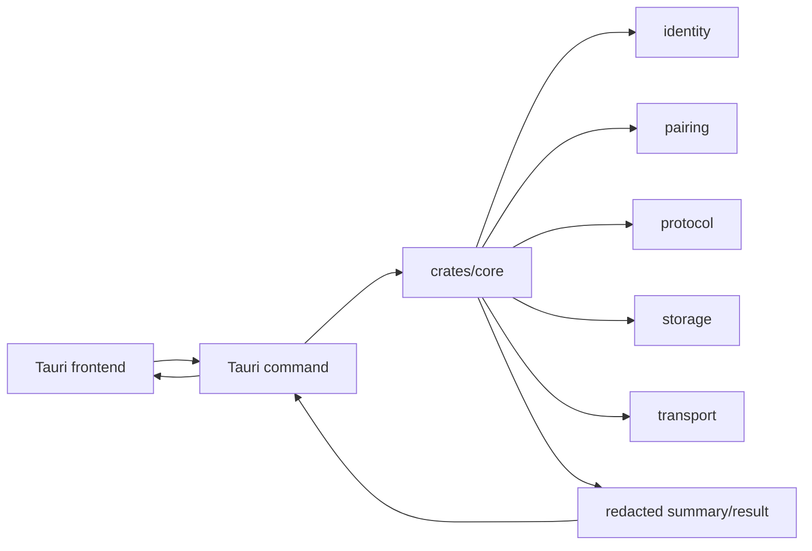

# 08. Tauri Shell And Rust Core Boundary

## 이 글에서 배울 것

이 글은 Tauri shell과 Rust core의 책임 분리를 설명한다.

Another Dimension Chat은 desktop UI가 있다. 하지만 UI가 보안 의미를 직접 만들면 위험하다.

핵심 원칙:

> UI shell은 사용자의 action과 display를 담당하고, security-sensitive meaning은 Rust core가 소유한다.

## 초보자용 비유

은행 앱을 생각해보자.

화면에는 버튼과 잔액이 보인다. 하지만 잔액 계산, 송금 검증, 계좌 권한 판단은 화면 JavaScript가 마음대로 정하면 안 된다.

화면은 사용자에게 보여주고 입력을 받는다. 중요한 판단은 backend/core logic이 해야 한다.

이 프로젝트도 비슷하다.

Tauri frontend는 profile unlock form, invite room UI, manual envelope buttons, diagnostics copy button을 제공할 수 있다. 하지만 protocol, storage, transport, pairing semantics를 새로 정의하면 안 된다.

## 정확한 기술 개념

### Shell

Shell은 사용자와 core logic 사이의 interface다.

desktop app에서는 다음을 담당한다.

- 화면 표시
- form input
- button action
- status rendering
- copy/download/export/import UI

### Core

Core는 product semantics를 소유하는 layer다.

이 프로젝트에서는 Rust crates가 core logic을 담당한다.

- identity
- pairing
- protocol
- storage
- transport
- orchestration

### Redacted Diagnostics

Diagnostics는 support나 debugging을 위해 상태를 요약한 정보다.

하지만 diagnostics가 raw logs, local paths, endpoint, payload, passphrase, key material을 포함하면 public support에서 위험해진다.

그래서 diagnostics는 redacted 상태여야 한다.

### Explicit User Action

Explicit user action은 사용자가 명시적으로 누른 action 뒤에만 위험한 작업을 수행하는 원칙이다.

예:

- network/onion attempt
- destructive delete
- local wipe
- export/import

앱이 시작되자마자 network work를 하면 user expectation과 threat model이 달라진다.

## 이 프로젝트에서는 어떻게 쓰는가

관련 source:

- `apps/desktop-tauri/src-tauri/src/lib.rs`
- `apps/desktop-tauri/src/main.js`
- `crates/core/src/lib.rs`

Boundary map:



Desktop platform boundary summary는 다음 같은 값을 표현한다.

- diagnostics redacted
- automatic network on launch false
- sensitive communication allowed false
- public beta security ready claimed false
- signing/notarization not trusted security boundary

## 관련 코드 파일

처음 볼 anchor:

- `apps/desktop-tauri/src-tauri/src/lib.rs`: `DESKTOP_PLATFORM_BOUNDARY_POLICIES`
- `apps/desktop-tauri/src-tauri/src/lib.rs`: `desktop_platform_boundary_summary`
- `apps/desktop-tauri/src/main.js`: `manualNetworkPermissionEnabled`
- `apps/desktop-tauri/src/main.js`: public diagnostics summary
- `crates/core/src/lib.rs`: app-facing summary types and orchestration functions

## 흔한 오해

### 오해 1. UI에서 검증하면 충분하다

아니다. UI validation은 도움이 되지만 security semantics는 core에서 강제해야 한다. UI는 쉽게 바뀌고, port마다 달라질 수 있다.

### 오해 2. Diagnostics는 자세할수록 좋다

아니다. public support에서는 자세한 raw data가 leak이 될 수 있다. diagnostics는 redacted summary여야 한다.

### 오해 3. 앱 시작 시 network 준비를 해두면 좋다

항상 그렇지 않다. 고위험 messenger에서는 app launch network behavior 자체가 metadata와 user expectation 문제를 만들 수 있다.

### 오해 4. Desktop shell이 있으니 mobile shell도 같은 의미를 가진다

아니다. mobile shell은 OS permission, notification, background execution, storage semantics가 다르다. shared Rust core를 쓰더라도 wrapper boundary를 따로 봐야 한다.

## 아직 claim하지 않는 것

현재 프로젝트는 다음을 claim하지 않는다.

- production-ready desktop UX
- representative usability completion
- public Windows artifact parity
- Android/iOS runtime parity
- app-store-ready mobile security
- public diagnostics가 모든 failure를 충분히 설명한다는 claim

## 직접 확인해볼 파일/명령

```bash
rg -n "DESKTOP_PLATFORM_BOUNDARY_POLICIES|desktop_platform_boundary_summary" apps/desktop-tauri/src-tauri/src/lib.rs
rg -n "manualNetworkPermissionEnabled|publicBetaDiagnosticsSummary|default_transport_network_io" apps/desktop-tauri/src/main.js
```

## 요약

Tauri shell은 사용자 경험을 담당하지만 보안 의미를 소유하면 안 된다. Rust core가 identity, pairing, protocol, storage, transport semantics를 소유하고, shell은 explicit action과 redacted status를 다룬다. 이 분리는 desktop뿐 아니라 future mobile shell에서도 중요하다.
