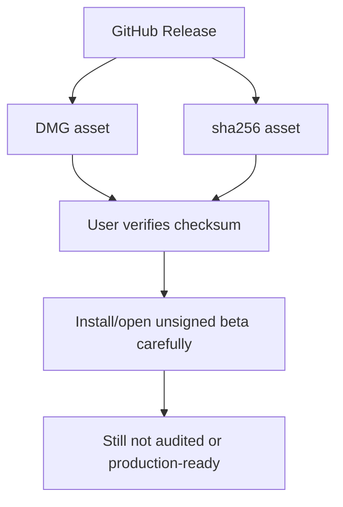

# 09. Release Security And Non-Claims

## 이 글에서 배울 것

이 글은 release security와 non-claim을 설명한다.

보안 프로젝트에서는 코드만 중요한 것이 아니다. 사용자가 어떤 파일을 다운로드하고, 어떻게 검증하고, README가 무엇을 약속하는지도 중요하다.

초보자가 구분해야 할 개념:

- checksum
- release authority
- signing
- notarization
- auto-update
- reproducible build
- supply-chain audit
- security audit
- production-ready claim

## 초보자용 비유

약을 산다고 생각해보자.

약 성분이 좋아도 다음 문제가 남는다.

- 포장이 바뀌지 않았는가?
- 제조사가 만든 것이 맞는가?
- 유통 중 변조되지 않았는가?
- 설명서가 효과를 과장하지 않는가?
- 임상 시험이 끝났는가?
- 규제 기관 승인과 독립 검토가 있는가?

앱 release도 비슷하다.

DMG checksum은 "이 파일이 release asset과 맞는가"를 확인한다. 하지만 그것이 protocol security audit를 의미하지 않는다.

## 정확한 기술 개념

### Release Authority

Release authority는 사용자가 어떤 출처를 기준으로 artifact를 검증해야 하는지다.

이 프로젝트에서는 DMG와 `.sha256`이 같은 GitHub Release asset set에 있어야 한다. `main` branch 파일이나 GitHub source archive로 downloaded DMG를 검증하면 안 된다.

### Checksum

Checksum은 file integrity를 확인하는 값이다.

SHA-256 checksum이 맞으면 파일이 expected release artifact와 일치한다는 근거가 된다. 하지만 app 내부 protocol이 안전하다는 근거는 아니다.

### Signing

Signing은 artifact가 특정 signing identity로 서명되었음을 보여준다.

macOS에서는 Developer ID signing이 Gatekeeper UX에 중요하다. 하지만 signing은 messenger protocol security proof가 아니다.

### Notarization

Notarization은 Apple이 macOS app을 검사하고 notarized ticket을 발급하는 절차다.

malware scanning과 distribution trust에 도움을 주지만, E2EE protocol audit와 다르다.

### Auto-Update

Auto-update는 사용자가 새 release를 쉽게 받게 한다.

하지만 update signing, rollback, compromised release 대응, emergency release policy가 필요하다. 잘못 만들면 update channel이 공격 surface가 된다.

### Reproducible Build

Reproducible build는 같은 source에서 같은 binary가 나오는지 확인하는 성질이다.

있으면 supply-chain trust에 도움이 되지만, 이것만으로 secure messenger가 되는 것은 아니다.

### Security Audit

Security audit는 독립적인 reviewer가 threat model, design, source, build/release, operational process를 검토하는 과정이다.

내부 테스트나 AI review는 audit가 아니다.

## 작은 fake example

아래는 release 관련 증거가 각각 무엇을 말하고 무엇을 말하지 않는지 보여주는 설명용 예시다.

| 증거 | 말할 수 있는 것 | 말하면 안 되는 것 |
| --- | --- | --- |
| `FAKE.dmg.sha256` 일치 | 받은 file이 expected release asset과 같다 | 말하지 않음: app protocol이 안전하다 |
| Developer ID signing | 특정 signing identity로 서명되었다 | 말하지 않음: E2EE가 audited다 |
| Apple notarization | Apple notarization 절차를 통과했다 | 말하지 않음: sensitive communication에 안전하다 |
| [scripts/verify_all.sh](../../scripts/verify_all.sh) 통과 | known local checks가 통과했다 | 말하지 않음: production-ready다 |
| external audit report | reviewer가 범위 안의 항목을 검토했다 | 말하지 않음: 범위 밖까지 모두 안전하다 |

## 이 프로젝트에서는 어떻게 쓰는가

현재 public beta는:

- unsigned experimental macOS Apple Silicon beta
- not notarized
- not audited
- not production-ready
- sensitive communication prohibited

Release flow에서 중요한 원칙:



## 관련 문서/파일

- [README.md](../../README.md)
- [README.ko.md](../../README.ko.md)
- [SECURITY.md](../../SECURITY.md)
- [SUPPORT.md](../../SUPPORT.md)
- [reference/UNSIGNED_PUBLIC_BETA_INSTALL.md](../UNSIGNED_PUBLIC_BETA_INSTALL.md)
- [reference/PRODUCTION_READINESS_CLAIM_GATE.md](../PRODUCTION_READINESS_CLAIM_GATE.md)
- [reference/PUBLIC_INTAKE_POLICY.md](../PUBLIC_INTAKE_POLICY.md)
- [scripts/verify_all.sh](../../scripts/verify_all.sh)
- [scripts/verify_full.sh](../../scripts/verify_full.sh)

## Verification Scripts

[scripts/verify_all.sh](../../scripts/verify_all.sh)는 lightweight verification entrypoint다.

대표적으로 다음을 확인한다.

- rustfmt
- focused core tests
- focused Tauri tests
- default build boundary checks
- frontend state tests
- frontend build

[scripts/verify_full.sh](../../scripts/verify_full.sh)는 더 무거운 local engineering pass다.

하지만 두 script 모두 다음을 의미하지 않는다.

- audit complete
- production-ready
- sensitive communication allowed
- reliable external delivery proven
- supply-chain-audited release

## 흔한 오해

### 오해 1. Checksum이 맞으면 앱이 안전하다

아니다. checksum은 file integrity 확인이다. app design이나 implementation security proof가 아니다.

### 오해 2. Apple notarization이 있으면 secure messenger다

아니다. notarization은 OS distribution trust에 중요하지만, messenger protocol audit가 아니다.

### 오해 3. Tests pass면 production-ready다

아니다. tests는 regression과 known boundary를 확인한다. production readiness에는 field evidence, audit, release integrity, usability, platform support가 필요하다.

### 오해 4. README에 "experimental"이라고 쓰면 책임이 끝난다

아니다. README, SECURITY, SUPPORT, release notes, app UI가 같은 non-claim을 유지해야 한다.

## 아직 claim하지 않는 것

현재 프로젝트는 다음을 claim하지 않는다.

- signed/notarized stable release
- production-ready
- audited
- reproducible build
- supply-chain-audited release
- auto-update safety
- sensitive communication allowed

## 직접 확인해볼 파일/명령

```bash
sed -n '1,120p' README.md
sed -n '1,120p' SECURITY.md
sed -n '1,120p' SUPPORT.md
rg -n "not audited|not production-ready|sensitive communication|checksum|release authority" README.md SECURITY.md SUPPORT.md reference
scripts/verify_all.sh
```

문서 작업만 할 때는 full verification이 항상 필요한 것은 아니다. 대신 `git diff --check`, Markdown link check, claim search가 중요하다.

## 요약

Release security는 "사용자가 받은 파일이 무엇인가"를 다룬다. Checksum, signing, notarization, update, audit는 모두 다르다. Another Dimension Chat은 현재 unsigned beta 상태를 명확히 유지하고, release integrity와 messenger security claim을 섞지 않는다.
