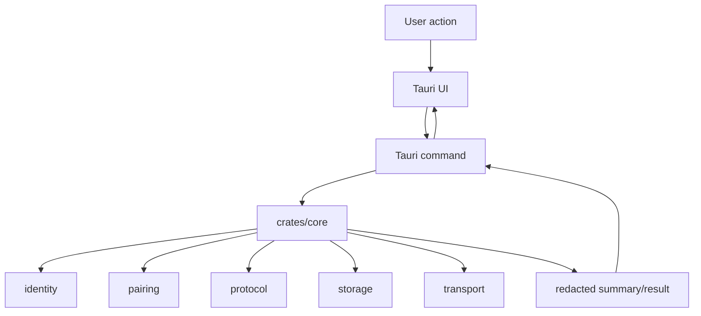

# 10. How To Read The Codebase

## 이 글에서 배울 것

이 글은 초보자가 Another Dimension Chat codebase를 어떤 순서로 읽으면 좋은지 설명한다.

이 repository는 보안/통신/storage/desktop UI가 함께 있어 처음 보면 크다. 처음부터 `crates/core/src/lib.rs` 전체를 읽으려고 하면 어렵다.

좋은 방법은 작고 의미가 명확한 crate부터 시작하는 것이다.

## 1단계. Public boundary 먼저 읽기

먼저 public docs를 읽는다.

- `README.md`
- `README.ko.md`
- `SECURITY.md`
- `SUPPORT.md`
- `reference/PUBLIC_THREAT_MODEL.md`
- `reference/COMPONENT_BOUNDARIES.md`

목표:

- 현재 public beta가 무엇인지 이해한다.
- claim하지 않는 것을 먼저 확인한다.
- no-central-trusted-server 방향을 이해한다.

확인 명령:

```bash
sed -n '1,180p' README.md
sed -n '1,160p' SECURITY.md
```

## 2단계. Protocol부터 본다

다음 파일:

- `crates/protocol/src/lib.rs`

이 파일은 비교적 작고, message envelope와 replay window를 직접 보여준다.

먼저 찾을 것:

- `Envelope`
- `MessageType`
- `pad_to_bucket`
- `ReplayWindow`
- `accept_after_decrypt`
- `encode_state`
- `decode_state`

확인 명령:

```bash
rg -n "pub struct Envelope|pub struct ReplayWindow|accept_after_decrypt" crates/protocol/src/lib.rs
```

읽을 때 질문:

- message number는 어디에 있는가?
- replay duplicate는 어떻게 막는가?
- decrypt 실패 시 replay state가 어떻게 되는가?

## 3단계. Pairing을 본다

다음 파일:

- `crates/pairing/src/lib.rs`
- `crates/identity/src/lib.rs`

먼저 찾을 것:

- `PairingPayload`
- `canonical_bytes`
- `production_pairing_payload_for`
- `production_pairing_nonce`
- `transcript`
- `verify_pairing_signature`

확인 명령:

```bash
rg -n "PairingPayload|canonical_bytes|production_pairing_nonce|transcript|verify_pairing_signature" crates/pairing/src/lib.rs
```

읽을 때 질문:

- pairing payload에는 어떤 field가 있는가?
- signature 대상은 무엇인가?
- safety transcript는 어떤 material에서 만들어지는가?

## 4단계. Storage를 본다

다음 파일:

- `crates/storage/src/lib.rs`

먼저 찾을 것:

- `ProductionRecordKind`
- `StorageProtection`
- `ReplayRollbackProtection`
- `SqlCipherRecordStore`
- `unlock_with_passphrase`
- `rekey_with_passphrase`
- delete helpers

확인 명령:

```bash
rg -n "ProductionRecordKind|StorageProtection|SqlCipherRecordStore|unlock_with_passphrase|rekey_with_passphrase|delete" crates/storage/src/lib.rs
```

읽을 때 질문:

- wrong passphrase일 때 record가 반환되는가?
- record kind는 어떤 product state를 표현하는가?
- delete helper가 secure deletion claim을 의미하는가?

## 5단계. Transport를 본다

다음 파일:

- `crates/transport/src/lib.rs`

먼저 top-level comment를 읽는다.

이 crate는 "완성된 transport implementation"이라고 보기보다 fail-closed guardrail과 transport policy boundary로 보는 것이 좋다.

확인 명령:

```bash
sed -n '1,140p' crates/transport/src/lib.rs
rg -n "Preflight|Permission|TransportMode|fail" crates/transport/src/lib.rs crates/transport
```

읽을 때 질문:

- default transport는 무엇인가?
- onion/Tor path는 언제 시도되는가?
- fail-closed 조건은 무엇인가?

## 6단계. Core orchestration을 본다

다음 파일:

- `crates/core/src/lib.rs`

이 파일은 크다. 처음부터 다 읽지 말고, 필요한 symbol을 검색해서 본다.

먼저 찾을 것:

- production profile summary
- production pairing session summary
- production message outbound envelope summary
- production receive/import path
- retention preference
- replay persistence tests

확인 명령:

```bash
rg -n "ProductionProfile|ProductionPairing|ProductionMessage|Retention|ReplayWindow|production_setup_drafts_can_encrypt_and_decrypt_envelope|production_receive_persists_replay_after_successful_decrypt" crates/core/src/lib.rs
```

읽을 때 질문:

- core가 어떤 crate들을 조합하는가?
- UI/CLI에 직접 raw secret을 주는가, 아니면 summary를 주는가?
- replay/storage/session state가 어떻게 이어지는가?

## 7단계. Tauri shell을 본다

다음 파일:

- `apps/desktop-tauri/src-tauri/src/lib.rs`
- `apps/desktop-tauri/src/main.js`

먼저 Rust command boundary를 본다.

확인 명령:

```bash
rg -n "DESKTOP_PLATFORM_BOUNDARY_POLICIES|desktop_platform_boundary_summary" apps/desktop-tauri/src-tauri/src/lib.rs
rg -n "manualNetworkPermissionEnabled|publicBetaDiagnosticsSummary|default_transport_network_io" apps/desktop-tauri/src/main.js
```

읽을 때 질문:

- desktop summary는 어떤 non-claim을 표현하는가?
- app launch에서 network/onion work가 자동으로 시작되는가?
- public diagnostics는 raw data를 포함하는가?

## 8단계. Verification scripts를 본다

다음 파일:

- `scripts/verify_all.sh`
- `scripts/verify_full.sh`
- `scripts/verify_default_boundary.sh`

확인 명령:

```bash
sed -n '1,120p' scripts/verify_all.sh
sed -n '1,120p' scripts/verify_full.sh
sed -n '1,120p' scripts/verify_default_boundary.sh
```

읽을 때 질문:

- lightweight hot path는 무엇을 확인하는가?
- full verification은 언제 필요한가?
- default build가 `dev-insecure`를 켜지 않는지 어떻게 확인하는가?

## 9단계. Public claim과 source를 맞춰 본다

마지막으로 public docs와 source를 같이 본다.

확인 명령:

```bash
rg -n "not audited|not production-ready|sensitive communication|secure messenger|reliable external onion" README.md README.ko.md SECURITY.md SUPPORT.md reference
rg -n "default_transport_network_io|sensitive_communication_allowed|public_beta_security_ready_claimed" apps/desktop-tauri/src-tauri/src/lib.rs apps/desktop-tauri/src/main.js
```

목표:

- README가 source보다 강한 말을 하지 않는지 확인한다.
- SECURITY가 current code boundary와 충돌하지 않는지 확인한다.
- SUPPORT가 private data를 요구하지 않는지 확인한다.

## 전체 caller mental model



## 초보자가 하면 좋은 작은 실습

### 실습 1. Envelope encode/decode 읽기

`crates/protocol/src/lib.rs`에서 `Envelope::encode`와 `Envelope::decode`를 찾아본다.

질문:

- prefix는 무엇인가?
- field는 어떤 순서인가?
- invalid input은 어떻게 처리되는가?

### 실습 2. Replay duplicate test 찾기

`crates/protocol/src/lib.rs` 또는 `crates/core/src/lib.rs`에서 replay 관련 test를 찾는다.

질문:

- 같은 message number가 두 번 오면 어떻게 되는가?
- tamper 실패 시 replay state가 advance되는가?

### 실습 3. Pairing payload field 찾기

`crates/pairing/src/lib.rs`에서 `PairingPayload` struct를 본다.

질문:

- owner profile과 pairwise public key가 분리되어 있는가?
- TTL과 issued time이 있는가?
- signature가 payload에 포함되는가?

### 실습 4. Public diagnostics redaction 찾기

`apps/desktop-tauri/src/main.js`에서 `publicBetaDiagnosticsSummary`를 검색한다.

질문:

- raw payload나 key material이 표시되는가?
- non-claim 상태가 포함되는가?

## 요약

이 codebase는 protocol부터 읽는 것이 좋다. 작은 primitive를 이해한 뒤 pairing, storage, transport, core orchestration, Tauri shell 순서로 올라가면 전체 구조가 보인다. 마지막에는 public README/SECURITY/SUPPORT가 source evidence보다 강한 말을 하지 않는지 확인해야 한다.
