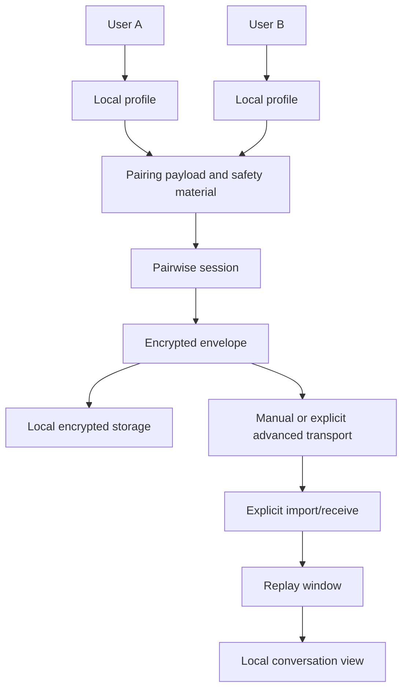
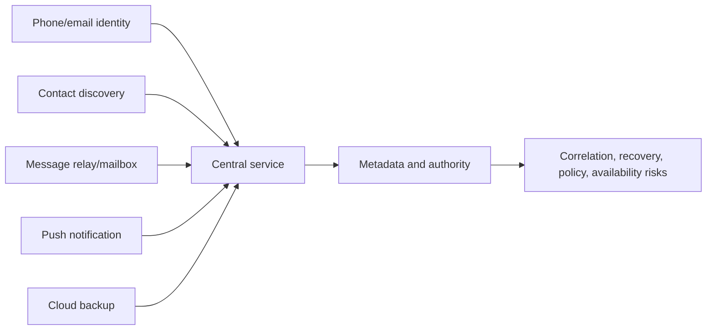
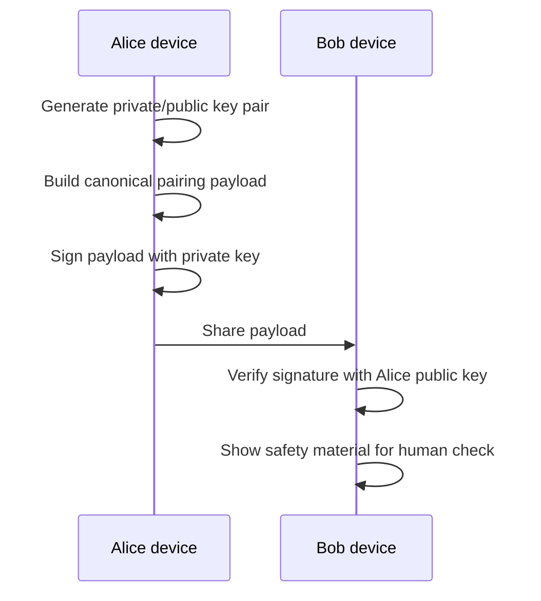
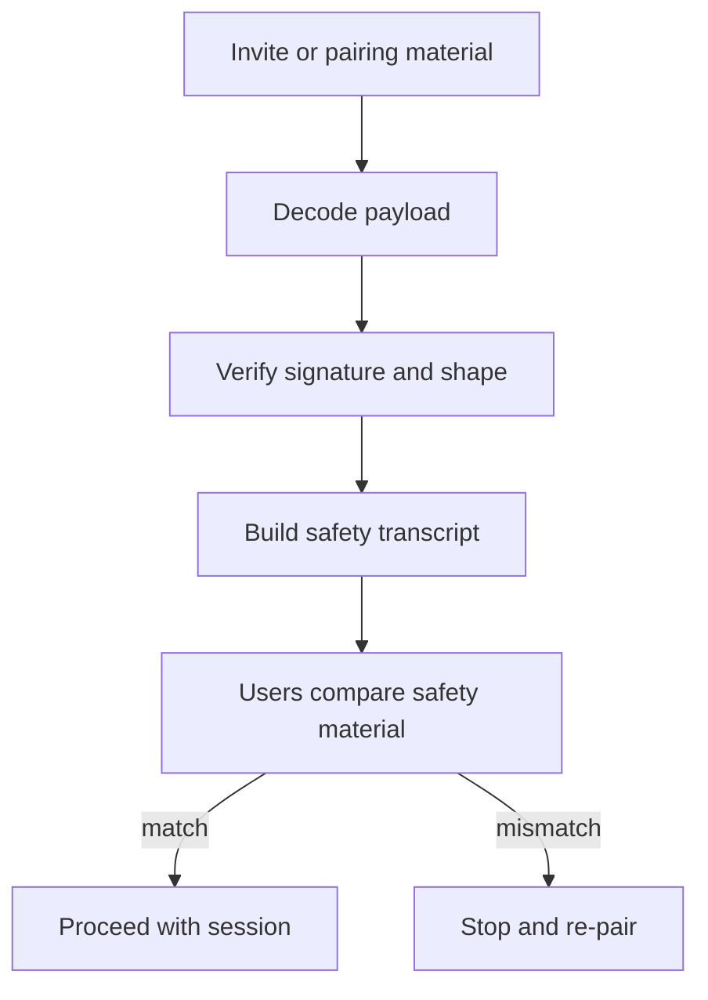
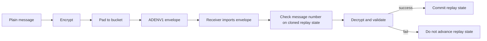
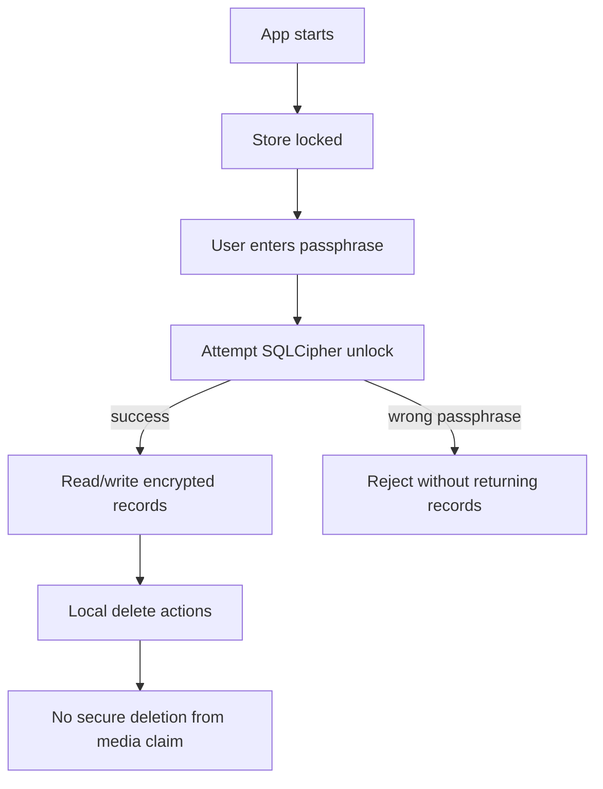
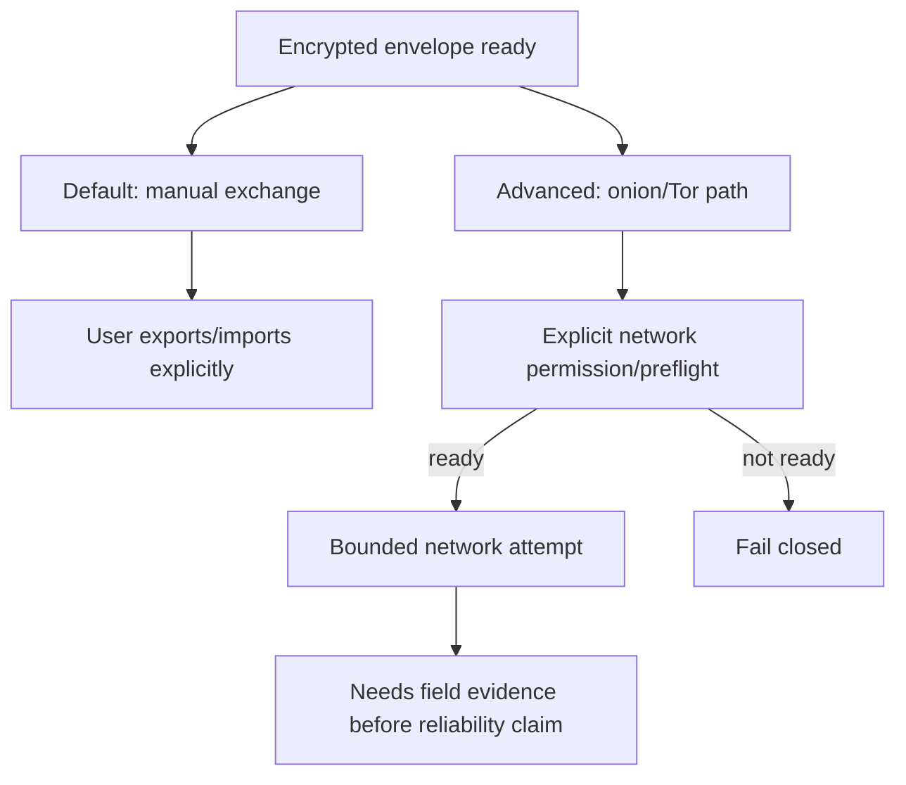
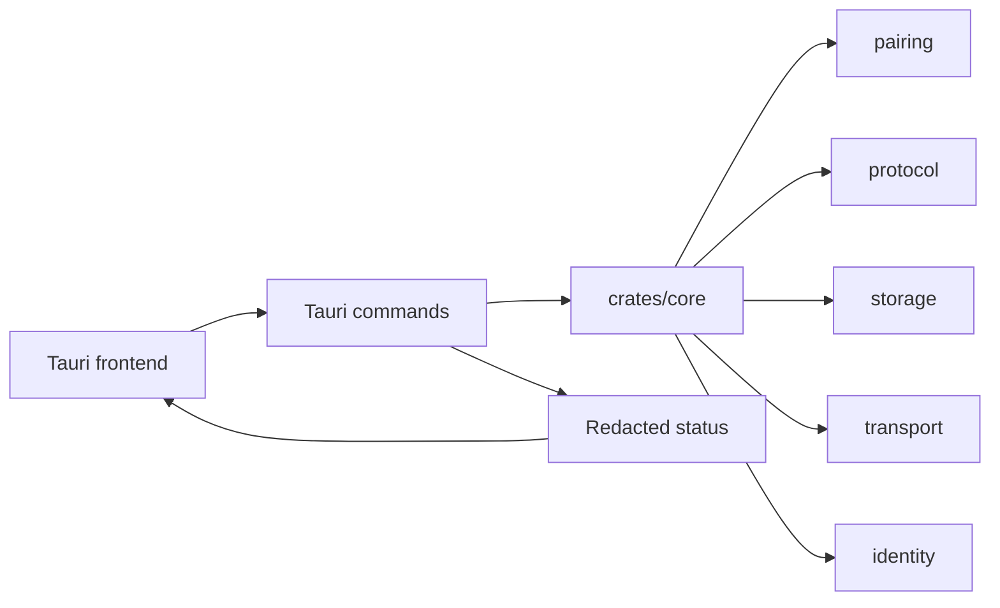
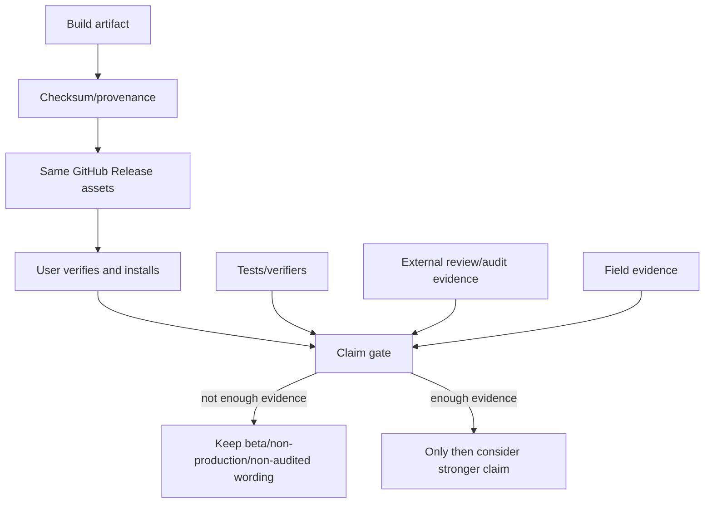

# Diagrams

이 문서는 technical guide에서 반복해서 사용할 수 있는 Mermaid diagram 모음이다.

## 1. 전체 개념 지도

## 2. 중앙 신뢰와 metadata

## 3. Key와 signature

## 4. Pairing과 safety verification

## 5. Envelope와 replay

## 6. Local encrypted storage

## 7. Transport decision

## 8. Rust core와 Tauri shell

## 9. Release와 claim gate

